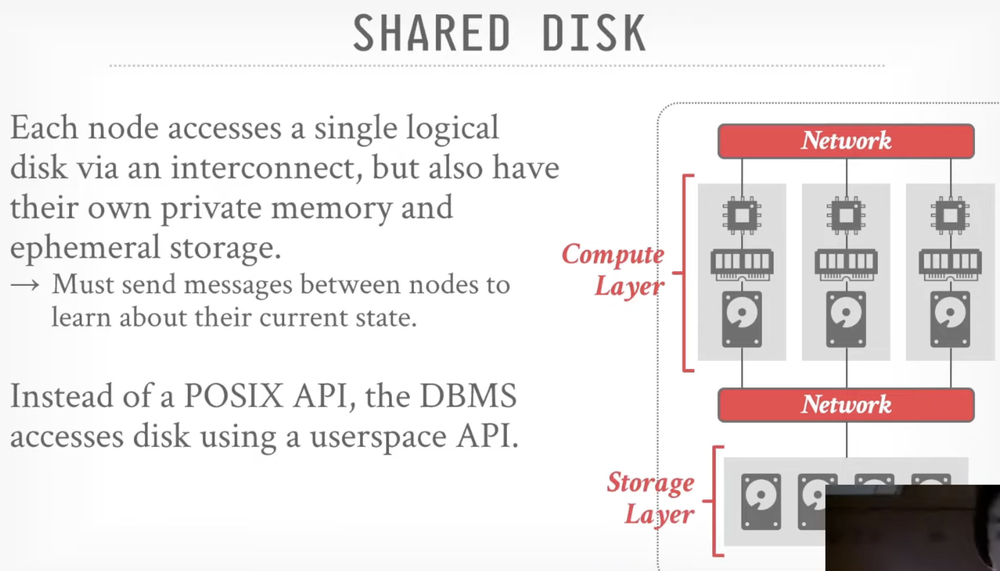
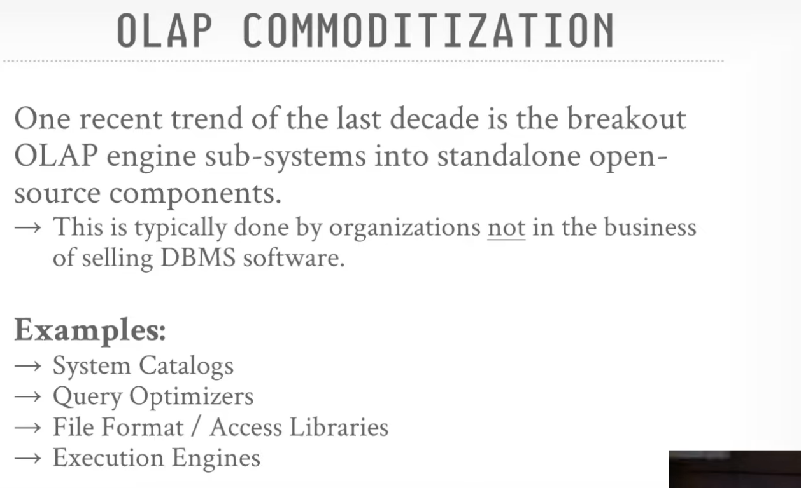
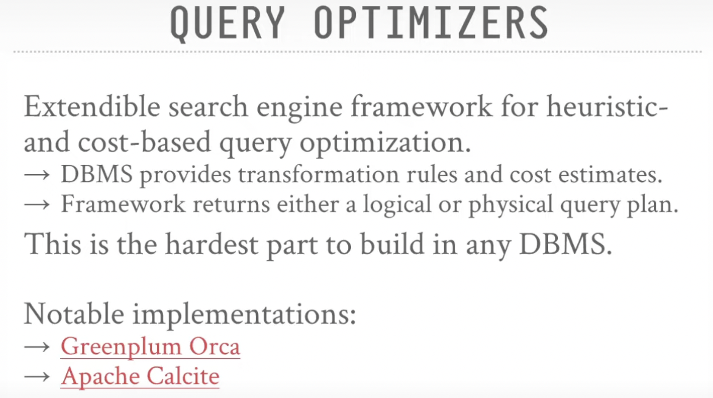

# 15721-Lec 2 Modern OLAP database

## Introduction

About Distributed Database system, (Andy's Opinion), you should have a high performance and robust single node first, making it distributed is not magic.

About the distributed query execution arch:

-  it is once not that good but as network now works faster, sometimes reading from network is faster than reading from disks, which makes it a good arch now. 

- the function of shuffle node is to redistribute data, they usually have loads of memory, doesn't need to spill the data to disks, good for sort/redistribute data

  

- How data are processed (not mutually exclusive)
  - Push query to Data
    - Send query to the node that data resides
    - do much filtering and processing before transmit the data
  - Pull Data to query
    - Send the data to the node where the query is executing
    - Is necessary when there's no compute resources where persistent data is located

​	They are not mutually exclusive now as some plain storage system (like s3 or blob systems) now can execute some filtering and queries.

## Arch

- Shared nothing system(kind of rigid arch today)

  - **POSIX API** like some standard filesystem API, if the database access disk through POSIX API, it can do any kinds of filtering using PIPE or other strategies. But if it is using **userspace API** which is provided by cloud vendor (eg. aws s3), the database system can only do filtering the userspace API allowed. It may not do complicated stuff.

  

- shared disks

  - traditionally the storage layer is some **on-prem NAS** but now it prefers **Object stores** like s3 as it is **"infinitely" scalable**.

  

- Pros and cons

  - Shared Nothing
    - Potentially better performance as it is reading data locally, without much data movement. But nowadays, it is not always true as networks are become faster and faster
    - Harder to scale capacity, one cannot add new node without redistribute it/shuffle it or remove node without coalescing data (存算不分离)
    - Storage and compute resources are not separate, single node more expensive (存算不分离)
  - Shared Disk
    - Scale compute layer independently from the storage layer, easy to shut down compute layer resources (consistent hashing), keeping a low cost for cloud based systems (存算分离)
    - May need to pull uncached data from storage layer before applying filtering (If the underlying storage only allows you to do certain filtering, you cannot add more complicated filtering)

## Storage

**PAX** is a columnar layout format which divides pages into mini pages so that read specific attributes are faster. For on-cloud database system, one block is usaully much larger than the disk page. Snowflake uses small block size among them but it still 50M/100M, so database system would never want to read a whole block unless they have to.

Andy also mentioned yellowbrick who writes their own object store instead of using amazon s3 to gain better performance. They probably using **kenel bypass**

- In a traditional network communication model, data travels through the kernel, which manages various networking tasks such as protocol processing, buffering, and data copying. This introduces some overhead and can impact the overall performance, especially in high-throughput and low-latency scenarios.

  Kernel bypass mechanisms aim to reduce this overhead by enabling direct communication between user space applications and network hardware, bypassing the kernel for certain operations. This is often achieved through the use of specialized APIs (Application Programming Interfaces) and frameworks that allow applications to interact directly with network interface cards (NICs) or other hardware components.

  One common example of kernel bypass is the use of user-level networking libraries or frameworks, such as DPDK (Data Plane Development Kit) or Intel's DPDK-inspired frameworks. These frameworks provide a set of APIs that allow applications to manage and communicate with network devices directly, without involving the kernel for data transfers.

## OLAP Commoditization

Companies selling database are writing same things to do same things. Recent years there's a trend to write OLAP sub-systems open source.

- **System Catalog**

  

- **Query optimizer**

  

- **File formats**

  Most DBMS use proprietary binary file format, the only way to transfer data is to convert it to commonly used format: csv, json,... Currently, there are some open-source binary file formats

  

- Execution engine

  