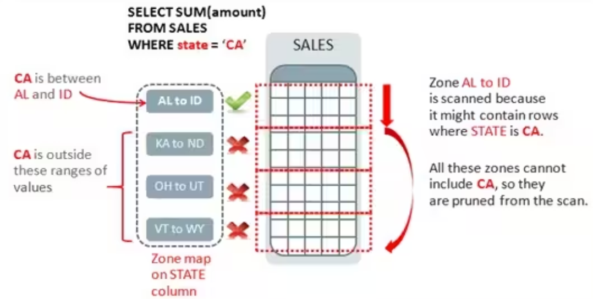

# Empirical Evaluation of Columnar Storage Format

- 起源：for data sharing among hadoop-based query engines, open source columnar storage formats, parquet and ORC appeared and became the standard for today's data warehouse and data lakes

- 变化：

  - hardware变快了
  - datalake把column-oriented文件更多的存储在便宜的云存储上(AWS S3,Azure Blob storage),这些存储high latency, high bandwidth
  - 更多lightweight compression schemes和indexing, filtering techniques在学界出现了，但是data formats还是based on 2000s的DBMS

- 主要发现：

  - Parquet有file size advantage以及更快的column decoding due to its simpler integer encoding also, ORC is more effective in selection pruning due to the finer granularity of its zone map;它们两者比较没有一个最终的winner
  - real world column-oriented data 有较小数量的distinct values(low NDV ratio)，适合dictionary encoding.所以它的decoding efficiency更多的和它的integer encoding algo相关
  - faster and cheaper storage means next generation formats should pursue faster decoding schemes than more aggressive compression to save I/O bandwidths.
  - parquet and orc 只有对auxiliary data structures(zone map, bloom filter)的简单支持，其实可以把更复杂的结构结合到format里面来precompute to save computation
  - existing columnar formats are inefficient in serving common ML workloads when handling projections of thousands of features and low-selectivity selection during top-k similarity search in vector embeddings.
  - 现有的format没有提供足够的parallel units来fully utilize computing powers of GPU

  

## Internal Design 

- parquet和ORC都用了PAX format, 先把一个table横向分成row groups,再store tuples column-by-column within each row group. DuckDB和Arrow就利用了PAX layout来实现对column chunks的parallel reads

  

- Both formats都用了lightweight encoding schemes to the value of each column chunk and general-purpose block compression algorithms to reduce the chunk's size. 他们的entry point是footer，footer里装了file-level metadata比如table schema和tuple count，还有每一个row group的offeset和each column chunk的zone maps
- 虽然parquet和ORC internal layout很像，但是他们在logical block和physical block mapping上的处理是不一样的，parquet是base在每个row group有固定数量的rows (1M rows), ORC是fixed physical storage size (64MB). Parquet确保了每个row group有足够多的entries来进行vectorized query processing，但是它可能造成太大的memory footprints，尤其是比较宽的table。ORC 有better control of memory usage但是可能导致large attributes没有足够多的entries。
- Parquet用最小的zone map来作为其compression unit。ORC则提供了block compression algorithm, 但是smallest zone map和compression unit之间的misalign可能导致extra complexity during query processing (一个值可能跨多个compression unit)

## Encoding

- Parquet和ORC都用了标准的OLAP compression tech: **Dictionary encoding, Run-Length Encoding, Bitpacking**
- Parquet对每个column（无论什么data type）都使用dictionary encoding（**比较激进**）, ORC只对**strings**用dictionary encoding
- 在dictionary encoding上，它们都又再加了一层integer encoding (parquet在这一步用了bitpacking和RLE)

fall back：

- parquet: 如果dictionary size超过一个limit, 就不用encoding（表明NDV可能太大导致dictionary encoding没啥用）
- ORC: NDV ratio超过特定threshold就不用dictionary encoding (比parquet更合理)

## Background knowledge

**Zone Map**

A table can be divided up into contiguous **regions of blocks** called zones (the default zone size is 1024 blocks for oracle). For each zone, the Oracle database **records the min and mx values for specified columns** in a zone map. 

**Encoding Schemes**:

1. **Dictionary Encoding:**
   - **Description:** In dictionary encoding, a unique set of values in a column is identified, and each unique value is assigned a unique integer code (dictionary index). The actual column data is then replaced with the corresponding integer codes.
   - **Usage in Parquet and ORC:** Both Parquet and ORC use dictionary encoding as one of their compression techniques. It is particularly effective when a column has a relatively small set of unique values.
2. **Run-Length Encoding (RLE):**
   - **Description:** Run-length encoding is a simple compression technique that stores consecutive repeated values as a single value along with the number of times it is repeated (run length).
   - **Usage in Parquet and ORC:** Both Parquet and ORC use run-length encoding to compress sequences of repeated values efficiently. This is especially useful for columns with runs of the same value, such as timestamps or boolean columns.
3. **Bitpacking:**
   - **Description:** Bitpacking involves storing multiple values in a single machine word, with each value occupying a fixed number of bits. This is possible when the range of values is limited and can be represented using fewer bits than the native size.
   - **Usage in Parquet and ORC:** Both Parquet and ORC use bitpacking as a compression technique for integer columns with a small range of values. By packing multiple values into a single word, storage space is saved.