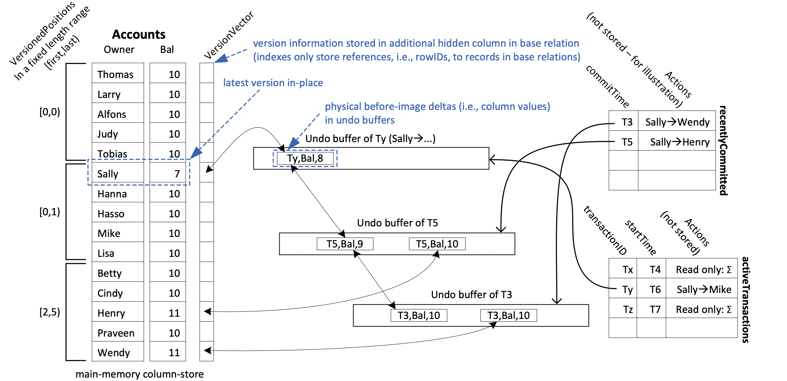

# MVCC for in mem database

背景：

- Transaction Isolation是DBMS的一个基础feature，确保每个transaction都像独自占有DB一样，传统的TI由locking提供
- locking有两个缺陷：
  - reader和writer有冲突
  - 从transaction的视角来看，read-only的transaction跟其他任何transaction没有冲突，也不存在顺序。但是由locking保证的TI不等所有read-only transaction结束不能开始update transaction；或者该update transaction会被abort
- 现代DBMS大多采用MVCC，每次update不更新原数据而是新建一个version，这种机制不用locking
- 实现MVCC的DBMS大多使用Snapshot Isolation
  - Snapshot Isolation确保每个transaction看见整个DB的certain state并且DBMS确保concurrent transaction不同时更新同一个data object
  - Snapshot isolation虽好，但是在这种isolation下一些non-serializable schedules are still allowed
- 虽然Snapshot Isolation不完美，但是传统实现完全Serializable的方法太expensive了
  - 传统方法要求DBMS keep track of every transaction's entire read set，对read-heavy的workload来说很大负担
  - 传统方法的设计有时导致silent data corruption，making the bugs hard-to-detect

方法：

1. 为了最大化scan performance，new updates(未committed)直接in place更改数据，同时维护一个back delta of undo buffer
2. 为了便于同一个transaction的undo，undo buffer of a same transaction is clustered together

**Undo buffer有两个作用**：

1. 算是未commit的transaction的一个before-image，如果transaction undo可以撤销
2. 存储committed version of data valid up to now
3. 图中Undo buffer of T3表示任意开始时间小于T3的transaction会看见T3update之前的value（sally的balance是10， wendy的balance是10），任意开始时间大于等于T3的transaction会看见T3update之后的value （sally的balance是9， wendy的balance是11）

**Transaction**：

1. 每个transaction有3个attributes， **Transaction id** (从$$2^{63}$$开始，远大于$$T_{starttimestamp}$$)，$T_{starttimestamp}$ 标记transaction开始的时间，$$T_{committimestamp}$$标记transaction committed的时间
2. transaction的start timestamp决定了它看到的db version是什么样的（通过这个来traverse version vector）
3. transaction的commit timestamp更新了它自己的update是在什么时间
4. uncommiteed的transaction的update只有自己能看到，因为它对应的timestamp特别大，是自己的transaction id（图中Ty的undo buffer）

Write-write conflict 在本文设计中通过abort避免：如果另一个transaction试图修改被还没有committed的transaction修改的data object（通过version vector中超大的transactionID timestamp发现），后一个transaction abort and restart；所以version vector的第一个指针要不是null，要不永远指向一个committed transaction的undo buffer（第一个指针可能在uncommitted transaction的中间状态指向它的undo buffer，但它迅速就会变成committed或者abort删掉，永远不可能有committed的undo buffer跟在uncommitted的undo buffer后面）

上述的这些设计对于read-only transactions来说够了，但是对于update operations，需要保证它看到的data在它更新的时候不变动。传统的设计是记录read set，但这对于要经常访问full table scan的workload (比如OLAP数据库)来说很昂贵

**validation phase**

1. 为了保证serializability，得确保all reads of a transaction在结束时还没有变动。本篇论文采用了optimistic execution+一个validation phase
2. validation phase检查在该transaction执行期间(startTimestamp -> committedTimestamp)，有没有最近完成的create transaction，update transaction，delete transaction，create & delete transaction和该transaction的read set相交
   - 传统的做法(postgresql)是tracking 该transaction的全部read obejects再最后完成时再读一遍，performance开销很大
   - 本文做法利用undo buffer，precision locking和recently commited transactions
     - 首先从在startTimestamp之后committed的oldest transaction开始，检查它undo buffer里的内容是否和transaction predicates match，如果match, abort current transaction

