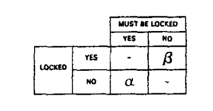

# Precison Locking

## Errors committed by locking systems

$\alpha$ and $\beta$ are two types of errors caused by locking.

For $\alpha$, there are 4 kinds of errors

-  Lost Updates - Txn2 overwrites txn1's update
-  Inconsistent data - Txn1 updates x and y to x' and y' but txn2 sees x' and y or x and y'
-  Instable data - Txn1 updates x to x'' but txn2 sees x' (intermediate)
-  Phantoms - Txn1 update a=1 where a=0; Txn2 update a=0 where a=1; txn1 commit; txn2 commit

For $\beta$ , it does not output inconsistent error, but it deduct system performance as not enough concurrency

