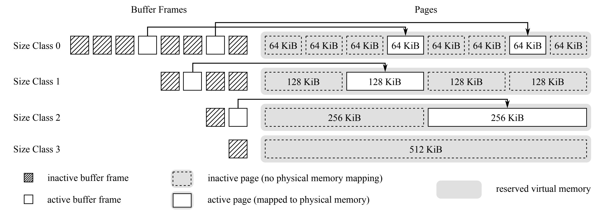
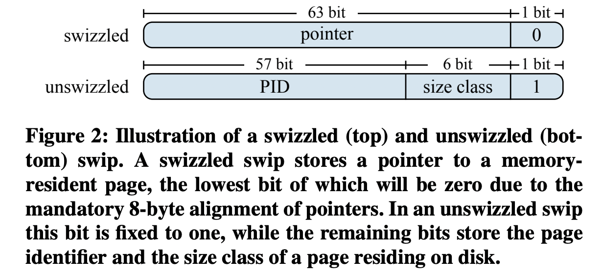
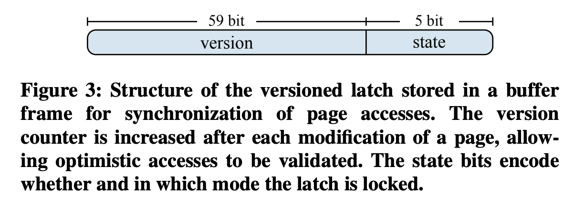

# Umbra

背景：

- ram size的显著提升导致很多系统可以完全把data放到memory里，促使了in memory system/database的出现
- in memory database/system 性能显著优于disk-based，但是当data不能全放进memory里时，这种system性能迅速下降
- 近年来，ram size没有再大规模的提升；同时SSD表现显著优于以前的disk
- large in memory bufferpool结合SSD是in memory database/system可行的替代品

**Contribution**:

- Variable-size buffer pool
- key adjustments for disk-based database
- string handling, statistics maintenance, execution model

## **Variable-size buffer pool**

背景：

- in memory database 一个显著优点就是不用bufferpool，code简单没有overhead
- 传统的disk based database用fixed size page 的bufferpool，但是处理不能装进一页的large objects很困难
- variable-size buffer pool page 有效地解决了这个问题，但是常见的variable size page都会有external fragmentation的问题

方法：

- Buffer pool通过mmap申请了一块连续的virtual memory的空间(64\*8+128\*4+256\*2+512)，这一段空间并没有分配physical memory mapping
- Buffer pool读数据或者写数据时该page获得physical mem mapping，并且确保该physical mapping不超过buffer pool申请的这块区域(MADV_DONTNEED for madvise)

通过类似buddy mem allocation的方式减少external fragmentation(https://en.wikipedia.org/wiki/Buddy_memory_allocation)

## Pointer Swizzling

背景：

- 单独variable bufferpool page不能解决disk-based sys性能上的缺点
- 传统的database sys中，将logical PID 通过一个global hash map到memory address往往是现代多核系统主要的性能瓶颈

方法：

- swip时umbra使用的数据结构，其本质是一个64bit的integer
  - swizzled swip指向在memory里的page，代表memory pointer
  - unswizzled swip前57bit存放PID，6bit存放size class，最后1bit代表这是一个unswizzled swip
- bufferpool manager通过swip获得了load一个page到memory需要的全部信息，区分memory-resident page和disk-resident page也只需要一个额外的条件判断

不足：

- 因为swip decentralized的本质，如果一个page被多个swip引用，那么evict的时候需要获取到所有引用他的swip来更新这些swip，umbra没法这样，所以它实现了一个tree保证一个page只被一个swip引用
- 这带来的第二点不足就是B+树这样的数据结构不能有叶子结点sibling之间的pointer，如果有就破坏了**一个page只被一个swip引用**这条准则

## Versioned Latch

背景：

- bufferpool manager中frequent的latch acquisitions也是一个性能瓶颈

方法：

- Umbra采用optimistic latching

- 每个buffpool中的active buffer frame都伴随一个versioned latch，这个versioned latch有三种获得模式：exclusive mode, shared mode, optimistic mode

  

- Versioned latch是一个64bit的int, 前59bit是version number会自动++当其保护的page被修改的时候；后5bit是state，代表该latch有无被上锁以及上锁的mode

  - unlock时state = 0
  - exclusive lock时state = 1，且write结束增加version
  - shared lock时state = n+1, n代表同时持有该shared lock的process/threads数量，释放时state-1，如果是最后一个释放shared lock的thread，需将state重置回0
  - optimistic lock本身不改变versioned latch的任何状态，它记住之前获取的version number，直接读该versioned latch对应的page。读操作结束需要validate version，如果当前latch version已经改变，则说明有其他thread更改了page，重新做读操作

作用：

- optimistic latch本身防止了concurrent read之前的相互竞争
- optimistic latch状态下甚至可以读unloaded page，因为bufferpool设置了MADV_DONTNEED确保virtual memory存在，只不过读到的是zero page
- 有optimistic lock mode还要implement shared lock mode的原因是：1. 减少了operator读操作最后做validation的负担 2. 避免了read-heavy OLAP queries执行时同时有其他write queries存在时候频繁的read invalid冲突

## Buffer managed relations

方法：

- B+tree, keys are tuple ids. 
- Tuple ids严格递增，保证了在tuple insertion的时候不会同时splitB+树的node
- 不会split leaf nodes，只有在insert tuple时当前leaf page 装不下tuple才会allocate variable- size new page
- inner node是固定的64KB（最小的page size），因为64KB装不下tuple的情况较少，所以绝大多数的buffer pool page是64KB
- Tuples within a leaf page用PAX layout，**not optimal**
- 多数对B+树page的访问都是通过optimistic lock mode，exclusive lock mode只有在split inner和allocate new leaf才需要；read lock mode只有在read tuples和load child page to disk时才需要，也就是说traversal本身性能开销小
- 没有叶子结点sibling指针的问题：只要parent node optimistic lock remains valid，可以cheaply navigate to next leaf node

## Recovery

问题：

- 如果一个128KB的page数据被delete了，disk space被两个64KB重用。system crash的时候只有log写入了，data还没有写入，ARIES读LSN的时候可能会错误的理解第二个64KB的page

方法：

- 只允许重用同个size page的disk space

理解：

- 不会有memory external fragmentation的问题，因为这是disk space的重用，disk上的fragmentation不用考虑

