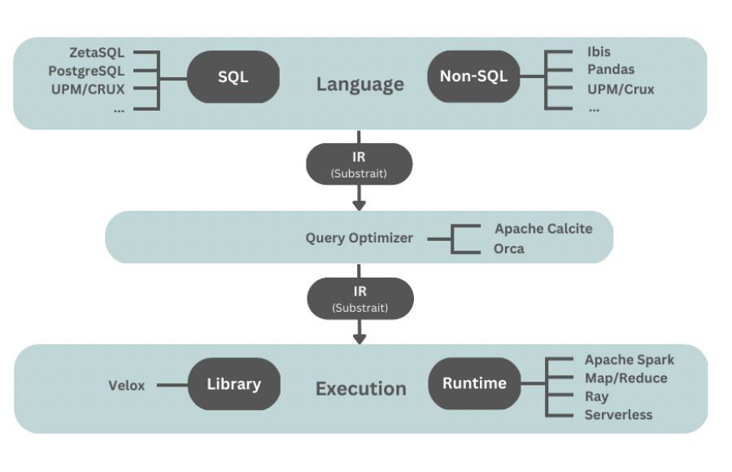

# Lec1 Composable DBMS - Manifesto

## Language Frontend

SQL parser + NonSQL(dataframes/PySpark/...) generates **same** IR.

## Intermediate Representation

Recent successful one: Subtrait

Pain point

- backward compatibility
- runtime semantic difference (different systems have different runtime settings, eg. one system will throw error during interger overflow, another will silently accept)
- Functions implemented by different systems vary a lot

## Query Optimization

**Orca** and **Apache Calcite** are the most known attempts in the area of composable and reusable optimizers.

Orca

- Orca provides a clear separation between the optimizer and execution engine by using an XML-based language to exchange information between the two. 
- While Orca is designed to be modular and extensible, it was reportedly non-trivial to integrate it with non-PostgreSQL systems

Calcite

-  Apache Calcite provides a full language frontend and IR, in such a way that users can either provide a SQL statement or Calcite’s own structured IR as input.
- IR translation is written in Java. It might be hard to integrate Calcite to non-java system.

## Execution Engine + Execution Runtime