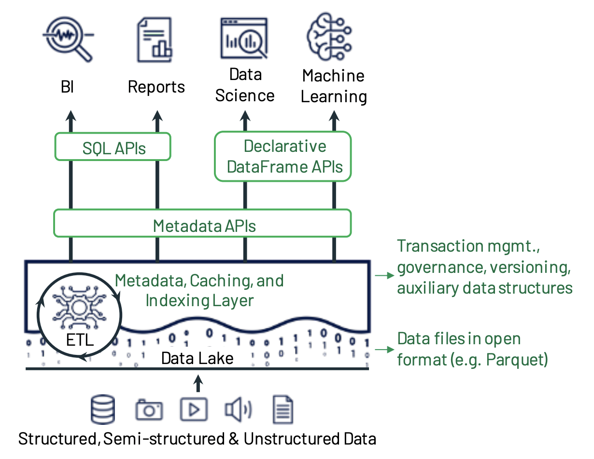

# Lec1: Lakehouse(2021) - databricks

## Intro

### **Main Idea**

data warehouse will be replaced by lakehouse.

**Lakehouse**

- is based on open direct access data formats as Apache Parquet/ORC
- have first-class support for machine learning and data science workloads
- have state-of-the-art performance

### History

- first generation: data warehouse, schema-on-write

  Cons:

  - 存算不分离，放在on-premise appliance(**HDFS**)，peak load的时候很贵
  - more and more data are unstructured

- second generation: data lake

  Pros:

  - 存算分离，cheap storage systems
  - schema-on-read，more flexibility on stored data

  Cons：

  - low data quality and problems of governance downstream

  S3等storage（更便宜，更好的durability）的出现将两层的data lake + data warehouse的模式推向辉煌

### Challenge

Data lake + warehouse is a complex structure. Data are ETLed to data lake and then ETLed to warehouse to do analytics work. And more advanced anlytics like ml workloads can not suit well on both data lake and warehouse.

- **Reliability**: hard to make data lake and warehouse consistent
- **Data staleness**: data in the warehouse are staled comparing to data in lakes. It takes days to ETL data to warehouse.
- **Limited support for advanced analytics**: ML workloads need to use large datasets.  Current structure offer two workarounds: 1. Dump warehouse data to file. That adds third layer ETL. 2. Directly access data in lakes. That loses management features in warehouse including versioning, ACID.
- **Total Cost**: double the price for storage as the data stores in lake and warehouse. The cost of continuous ETL.

## Lakehouse

- **Reliability data management**

**Delta lake** and **Apache Iceberg** adds transactional views of data in data lakes. It supports storing raw format data and with less ETL steps, it can enable management features on data lakes directly.

- **Support for ML workloads**

ML sys places them well in using lakehouse data as they use **dataframe** API.

- **SQL performance**

Lakehouse provided state-of-the-art SQL performance as it uses many techiniques to optimize on auxilary data and data layout based on Parquet/ORC.

### Structure

Lakehouse use low-cost object store (S3) as the storage for major data. But it adds meta-data to store where the data is located, providing management capabilities. Besides, it uses caching (stroing hot data on fast devices as SSDs), indexing, maintaining statistics and data layout optimization to ensure the performance. It also provides dataframe APIs for ML workloads.