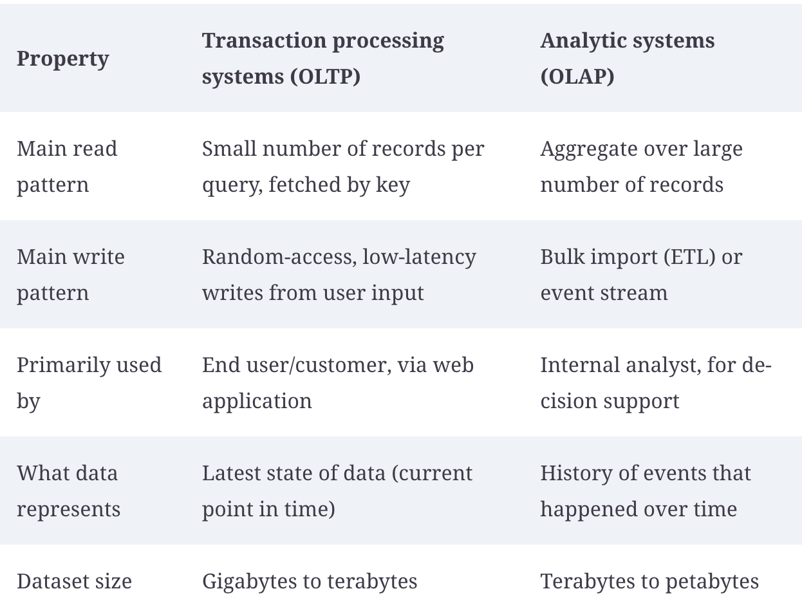
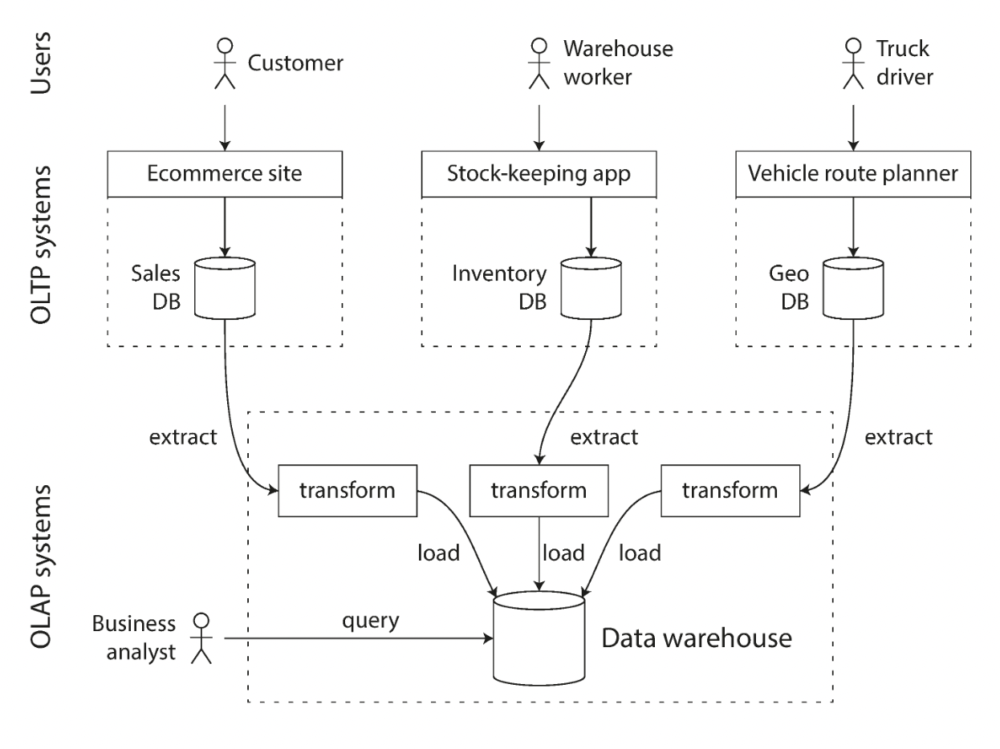
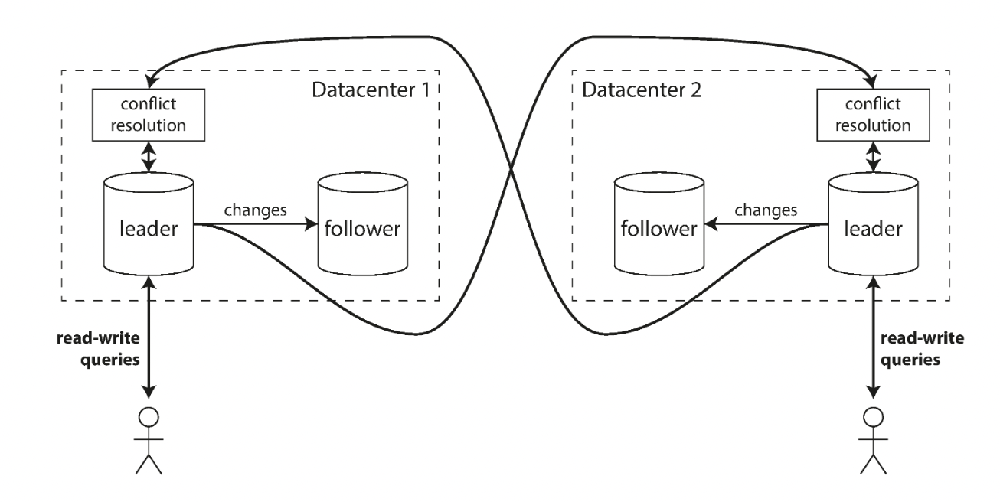
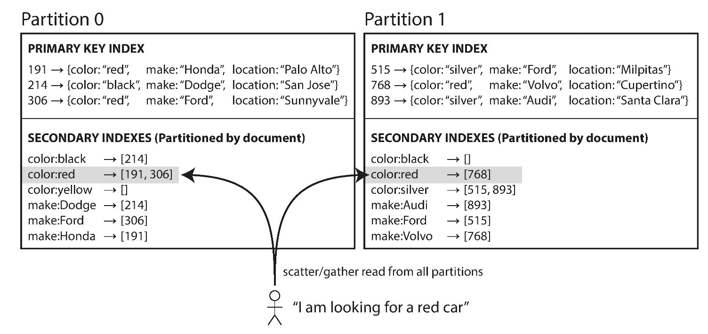
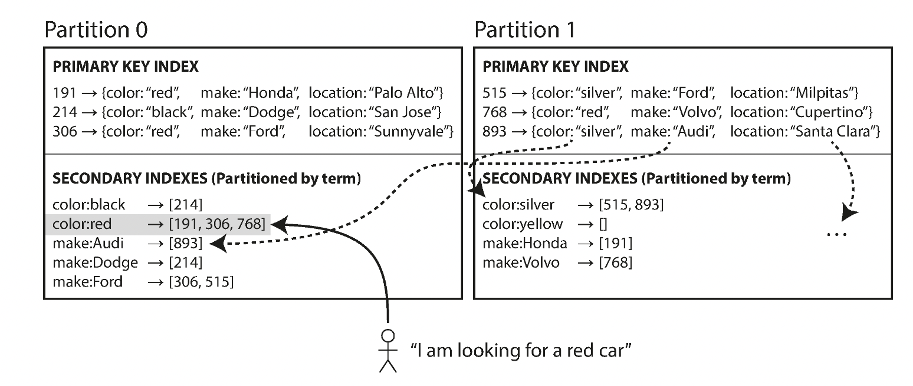
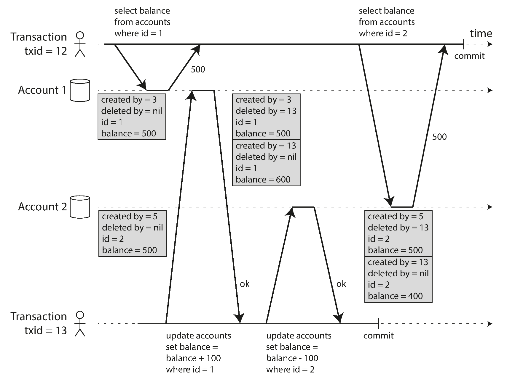

# Data Model and Query Language

- response time 用percentile(histograms chart)来表示比较好，xx%的用户的response time小于等于多少，mean response time意义不大

## Relational DB vs NoSQL数据库（Not Only SQL数据库）

- Document数据具有更好的局部性，搜索一条简历的内容在json里只用一条搜索；但是在关系型数据库中涉及多个表的join和query
  - 但是这种局部性只有在用户需要一条记录的大部分内容时才会更有优势，比如需要取一整个json文件来render网页，在关系型数据库中需要反复lookup和join，而document数据只需要一条记录
  - 建议document数据小而且尽可能少write操作
  - 关系型数据库通过声明一张表的各属性需要nested存来提供这种局部性
- 但是document数据受限于多对一的关系(许多人在一个工厂工作)和多对多的关系(一个人推荐了另一个人)，搜索一个工厂所有员工的json数据需要多次query并在application code中做合并，但在关系型数据库中就是一张表
- document数据是`schema-on-read`，写的时候没有规定schema，读的时候期待某种schema，更像编程语言中的动态类型检查；关系型数据是`schema-on-write`，写的时候强制规定schema，更像编译器执行的静态类型检查

## Graph-Like Data Models

如果数据多是one-to-many或者没有关系，可以用document，简单的many-to-many或者many-to-one用关系型数据，如果很多many-to-many关系，可以用graph-like数据库

- **Property Graph Model**(Neo4j, Titan, InfiniteGraph)

  - 点：unique identifier，入边，出边，properties(k-v pairs)
  - 边：unique identifier，起点，终点，关系，properties(k-v pairs)
- **Cypher query language**（Neo4j）
- **Triple Store**（类似property graph model）
- **SPARQL**

- Imperative vs Declarative
  - Imperative: user决定代码执行是什么顺序 eg：c/c++ javascript..
  - Declarative: user只告诉最后需要什么，不限制具体执行顺序和方式 eg：SQL，CSS
  - MapReduce：somewhere in between

`shreding`: 关系型数据库将hierarchical data变成多张表的过程

# Storage Engine

- Index提速read操作，但是会减慢write（因为需要维持index）

## Append-Only Logs with Hash Map in memory

Log files是append-only的，如果delete log，则在相应的位置放上一个tombstone占位。log file存在磁盘上，根据写的时间划分segments，每次先找most recent segment，segment数量达到一定程度的时候merge segment。Hash map存在内存里，保存key和对应的value位置。

Pros:

- append-only logs是sequential write，比random write更快
- concurrency和crash recovery对append-only logs来说更简单，因为它清晰地记录了old val和new val，不会出现在overwrite一半的时候crash导致old和new都不能用的情况
- hash map保存在内存中，适用key很多变化，val变化不多的情况
- 经常merge append-only log segments保证了它不会使得磁盘碎片化

Hash map index Cons:

- Hash map对range queries比如查[kk1001,kk9999)之间的内容这种task来说太慢，需要遍历
- 如果key太大或者太多，hash map内存装不下就失去了它的价值。hash map存在disk中就变成了random access，效果不好

## SSTable(Sorted String Table)

将log的键sort之后保存在disk中，内存中不用存全部的hash map，存储部分，并从某位置开始搜索即可（可以将两个index item之间的所有kv pair分块）。write操作需要维护顺序。

write操作的维护：

- tree结构(B-tree, red-black, AVL...) in memory，每次新来一个write更新内存中的tree（也叫memtable），memtable一定size的时候，写进磁盘当成most recent SSTable segment。
- 查找的时候先找内存中的memtable，找不到就找磁盘中的most recent segment，依次往下
- 为了保证内存中的memtable crash不丢失，另维护一个无需sorted的append-only log，如果crash通过该log恢复内存中的tree；如果memtable写磁盘丢弃这些log

Pro:

Range queries特别快

Con：

上述这种设计在查找数据库中没有的键时会特别慢（遍历memtable->most recent segment->...->oldest segment），解决办法是添加**bloom filter**

## B-Tree

与SSTable相似，B-Tree也保存sorted key，kv lookup和range queries特别快

与SSTable不同的是SSTable是sequential write，把数据库划分成大小不等的segments，不同的segments之间没有大小保证；B-Tree是把数据库划分成大小相等的blocks， blocks之间有大小保证

几乎所有的database都可以存进3-4层的B-Tree中，一个branching factor是500，page size是4KB的B-tree可以存到250TB

Con：

与SSTable只追加不同，B树会overwrite，所以如果在overwrite一半或者split一半的时候crash，会得到一个无效的b树。所以一般B树的更新会使用write-ahead log或者copy on write

B树需要更仔细的concurrent control

## B-Tree vs LSM-Tree(SSTable)

LSM-Tree write更快，write throughput更大；B-Tree更适合read。

B-Tree和LSM-Tree都会导致一次写db，多次写disk(**write amplification**): B-Tree需要写一次write-ahead log，写一次page；LSM-Tree需要在后台merge segments；总的来说LSM-Tree的write amplification更小

LSM-Tree的background merging可能会影响前台的read和write操作，因为磁盘空间和disk bandwidth有限，可能出现部分write需要等待background merging结束才能写，considering higher percitile，response time可能很大。也可能出现write太多太快，backgound merging跟不上导致segments太多打爆disk的情况

同样的key在LSM-Tree中可能会有多个copy，B-tree中只会存在一次。所以偏好事务性管理(强调独立性)的db更偏好用b-tree

## In-memory DB

In-memory DB更快不是因为他不需要读disk (有些in memory db仍然需要disk I/O为了durability；如果memory够大，disk-centric的DB也不一定需要读disk)，而是因为它不需要额外的开销来把内存数据encode成能存到disk上的格式

In-memory DB也可以提供大于可用内存的存储空间，least recently used blocks可以换到disk上，需要时再加载（类似virtual memory和swap pages）

# OLAP vs OLTP

传统的数据库一般用于OLTP(online transaction processing)，这种操作是交互式的，比如写xx存了多少钱，读xx账户里有多少钱

现在也有越来越多da通过数据库来做分析OLAP(onlie analysis processing)，通过读数据库来表示一月所有用户的平均流水，most important customer有什么特征等等

## Data warehouse

专门用来做OLAP的数据库。Data warehouse的产生是因为很多系统对OLTP数据库有低时延的高要求，所以不想让data analysist在OLTP数据库上运行时间成本可能很高的analysis task。Data warehouse定期或持续地读OLTP数据库，然后把数据变成更易分析的格式。

## Storage Engine for OLAP DB

- data model： **star schema** (dimensional modeling)
  - Star schema的中心是**fact table**，记录每一条event（这也代表fact table特别大）
  - fact table的column要么是简单的attribute(sale price of an event);要么是一个**dimension**（每个dimension连接到一个dimension table，记录who,what,when,where,how）

- **column storage**：OLAP的work一般需要access to全部行，但只需要很少的column（SELECT *很少用在OLAP中），所以与OLTP数据库存row-based不同的是，很多OLAP都是column-based
  - 由于每个column unique value其实不多，可以通过bitmap来进一步压缩。如果column只有n个unique value，就创建n个bitmap。
  - 如果n很大，每一个bitmap可能有很多0，bitmap还可以进一步压缩成run-length encoding，比如 product_id=29: 00001100的bitmap，可以进一步压缩成product_id=29:4,2(4个0,2个1,后面都是0)
  - **write optimization**:上述说的压缩让写操作变得更有负担，如果在一个维持了order并且run-length encoding的数据库里新加数据，可能所有columns都要重写。optimization可以用LSM-Tree类似的思路，维护一个in memory memtable，到一定file size存disk并merge
- **materialized view**：OLAP经常需要各种聚合，sum，avg...可以把这些结果存成cache

# Encoding

常用的有json,XML,CSV. 缺点是冗余信息，decode慢。

更compact的有thrift, protocol, arvo. Arvo对backward compatiblity和forward compatibility的支持更好。

## RPC vs Rest vs Message Queue vs Actor Framework

- Restful API
  - 只是一种设计概念，通常用于跨组织间，利用Internet，搭在HTTP上
  - 简单
- RPC
  - RPC的理念，让调用远程procedure和local一样是不可能的，因为本质上就差很多。现代RPC框架接受了他们的差别。
  - 现代RPC框架很多搭在Rest API上，附带service discovery(查找提供service的ip地址和port)
  - RPC需要datatypes encode，thrift，protocol等等都支持
  - 通常用于同组织同数据中心
- Message queue
  - 分离sender，receiver。messages在broker中短暂存储，broker负责向crashed receiver重发消息
  - 单向的，但是一个sender可以有多个receiver
  - sender不用知道ip和port，利于云环境中vm多变的情况
- Distributed Actor Framework
  - 结合了message queue和actor model
  - 常用的有akka，orlean，erlang otp

# Distributed

`shared-memory archi` 成本高，`shared-disk archi`受锁的限制，`shared-nothing archi` best choice，需要维护consistency

两种distributed方式：`replication`, `partitioning`,通常application会都实现

## Replication

- Single Leader
- Multiple Leader
- Leaderless

- Synchronous replication

- Asynchronous replication

- Semi-synchronous replication

  

Replication Implementation

- statement-based replication（MySQL5.1之前用这个）
  - 写指令同步给各个replica，replica上各自执行
  - 如果是RAND()或者其他结果是non deterministic的statement，各个replica上的结果会不一样
- write-ahead log shipping（Postgresql, Oracle）
  - SSTables & LSM-Trees结构下log存储主要内容
  - BTree结构下log是write ahead log
  - leader收到写请求，写log到disk同时也把log传给其他replica，其他replica根据log复现状态
  - 但是WAL精确到具体哪个bit要怎么写，所以和storage engine紧耦合。也就是说如果leader version和follower version不一致，很可能出现错误。这种要求就导致了不能再升级的过程中先升级follower，再升级其他的node。（这种升级很常见，所以这个弊端很不好）
    - 解决办法是可以用logical log

multiple leader

- 每个node都可以执行write操作

- 在同一个datacenter中使用multiple leader意义不大，通常是一个datacenter一个leader，leader将写操作异步replicate到其他datacenter的leader

  

- the biggest problem in multi-leader replication: write conflicts
  - avoid conflicts: always route the same user to the same datacenter(same leader), so all of his reads/writes seem reasonable to him
  - handle conflicts:
    - give each write a unique ID, higher wins(**prone to data loss**)
    - give each replica a unique ID, higher wins(**prone to data loss**)
    - combine them together,shown write B and write C as B/C
    - record conflicts in explicit data structures, let application handle (eg:prompting user)

leaderless （Amazon Dynamo）

- client directly sends writes to all replicas or send to coordinator, coordinator send to all replicas(coordinator does not ensure the order of writes)
- client writes to replicas in parallel(if quorum agrees, consider successful), reads from replicas also in parallel, once detect different version, old version number is detected as stale
  - Read repair: once client detect stale replica, writes newer version to it
  - Anti-entropy process: background process constantly looks for difference
- quorum: w replicas agrees writes, reads forward to r replicas, n replicas in total, as long as $w+r\gt n$, ensure read latest version
  - w和r不一定一直是$(n+1)/2$,如果write多，可以让w小，r大；read多可以r小w大
- leaderless常用于multi-datacenter operation

## Partition

skew：partition不均衡，所以有些node会接受特别多的request

hot spot：接受特别多request的那个node

- partition by key range
  - easy for range scan
  - downside：很容易就导致certain pattern -> hot spot
- partition by hash of key
  - each partition is assigned with a range of hashes, evenly distributed
  - 不适合database，所以in practice不常见
  - 不适合range queries, lost sort order

**relieve hot spot**

在社交网络的场景中，如果一个网红发布了消息，那可能会出现同个key特别多read write操作，导致那个replication特别hot

这种可以在write hash前在key上加random number，将write分散到不同的replication，但如果这样读操作会有额外的overhead，需要读全部的random number+key，然后汇总他们

**secondary index**

上述的partition针对key-value的模型很有效，但是如果records用了secondary index，就需要更复杂的设计

- document partitioned index：secondary index被每个partition单独管，也叫local index

​	如果用户查询“car with red and made by ..”，就需要添加secondary index make和color。partition主要根据primary index也就是car ID分，写partition的时候每个partition自动更新它的secondary index

​	但是读的时候需要读所有partition，虽然可以并发读，但是增加了tail latency amplification(百分比的那个)

- term partitioned index

  

Term partitioned index 不同于document partitioned index，系统维护了一个global index，并且将这个global index按照term分到不同的partition上。eg: color value a-r的存到partition0，r-z的存到partition1

## Assign Partitions to Nodes and Rebalancing

- **Do not mod by N**
  - 缺点：如果一旦增加或者减少Node，很多partition都要重新移动
- When add/delete new node, new node steal one partition from each existing nodes
- partition策略
  - Can use fixed number of partitions, with each partition handles fixed fraction of data
  - dynamic partition: partition太大，分成两个；partition太小，合并

# Transaction

## ACID

### Atomicity

db的atomicity不同于concurrent processes的atomicity：

- concurrent processes: 不同的process不能互相影响（这其实是ACID中isolation的内容）
- db atomicity: 如果在writes中出现server crash，要么rollback要么成功不会出现half way的内容

### Consistency

consistency其实是application定义的，database只能存储application定义的consistency，并且检查部分（外键约束etc）

consistency例子：银行存取款credits和debits必须是平衡的

### Isolation

db中的isolation就是如果同时有多个用户修改同一个东西，他们的修改不会互相干扰
最常见的isolation就是**serializable**，就是这些修改是有序的，让他们顺序执行。但是serializable带来了**性能的损失**，实现perfect serializable很困难。

### 不同的isolation level

- **Read Committed**

  1. Guarantee1: 所有read只会看到committed的值（No dirty reads）
     - dirty reads: 一个transaction看到了另外一个正在进行中的transaction修改的值，如果进行中的transaction最终fail了，那么这个transaction看到的值不可靠
  2. Guarantee2: 所有overwrite只会覆盖committed的值（No dirty writes）
     - dirty writes：如果有两个transaction并发updates multiple objects，如果db允许overwrites uncommitted value，可能transaction A overwrites table X，transaction B overwrites table Y

  实现方式：

  - prevent dirty writes：每一个object有一个row-level lock，想要修改这个object的transaction获得锁，直到该transaction结束释放锁
  - prevent dirty reads：如果用锁来实现dirty reads，一个长时间的write transaction可能block住很多read transaction；所以大多数database维护两个值，一个旧值和一个当前获得锁的transaction写入的新值；当前transaction未结束时所有read操作看到旧值

- **Snapshot Isolation**

  Read Committed isolation已经能提供stronger gurantee than systems without transaction也能满足大多数application的需求了。但是只使用read committed isolation可能会出现read skew的问题（一个人有两个账户，第一次看账户1的时候看到了账户1在钱从账户2transfer账户1之前的状态，第二次看账户2的时候看到了钱transfer之后的状态，就会以为自己的总额变少了；这种情况其实她简单再看一次就能发现自己的账户又均衡了）。但是这个问题在做**backup**的时候是不被接受的（做backup的过程中同时有multiple writes的话可能backup的一部分是旧的，一部分是新的），同理，在做**analytic queries和integrity checks**的时候也是不被接受的

  实现方式：

  - prevent dirty writes: 和read committed 一样的实现方式

  - snapshot isolation：每一个记录保留multiple version(**MVCC**, multi-version concurrency control)，记录这个record对应的**created by**和**deleted by**的transaction ID，给transaction分配单调递增的id（txid），在这个transaction开始的时候，db让这个transaction看见所有在它之前committed的txid小于它的writes和deletes

    

  - Indexes：有些db实现统一的index，然后根据visibility filter out 看不见的record; 有些db实现append-only/copy-on-write的B树，这样一个transaction writes对应一个B树索引

  Snapshot Isolation的命名在不同的db中不一样，oracle中叫**serializable**，PostgreSQL和MySQL中叫**repeatable read**。

### Durability

单点的db所说的durability就是把transaction成功的writes写入磁盘，利用WAL去做recovery如果在写的过程中故障了

distributed db所说的durability还有让所有replica都成功写入的意思
