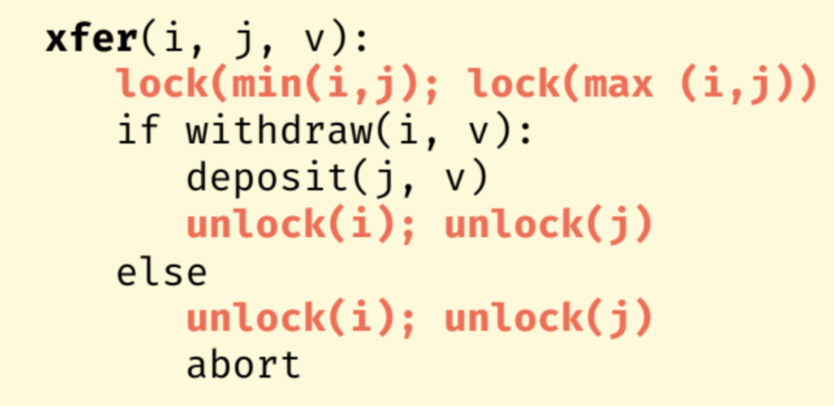
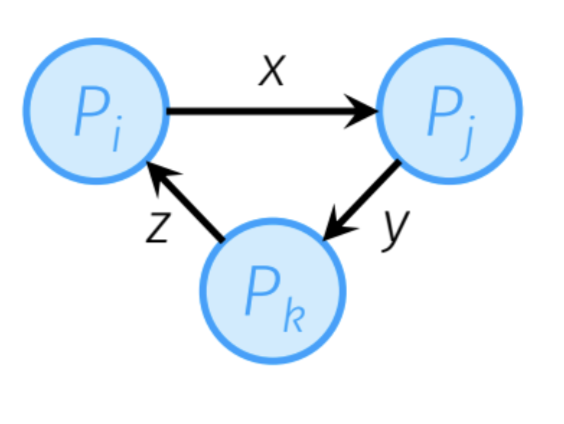
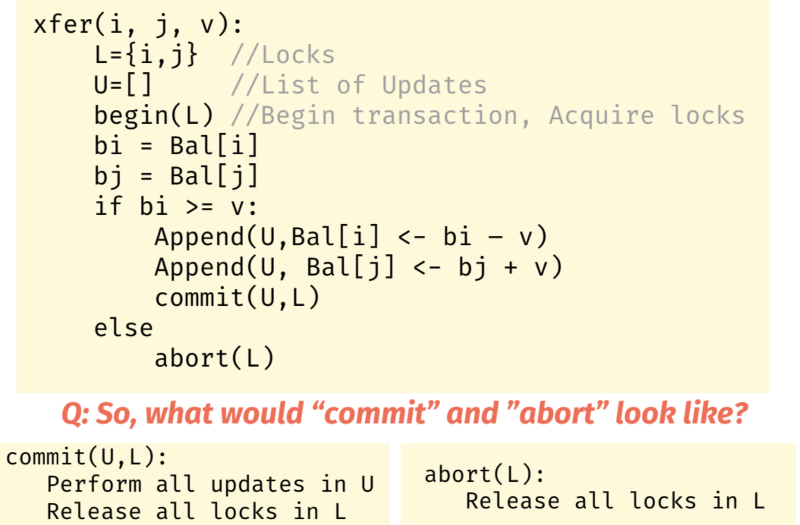
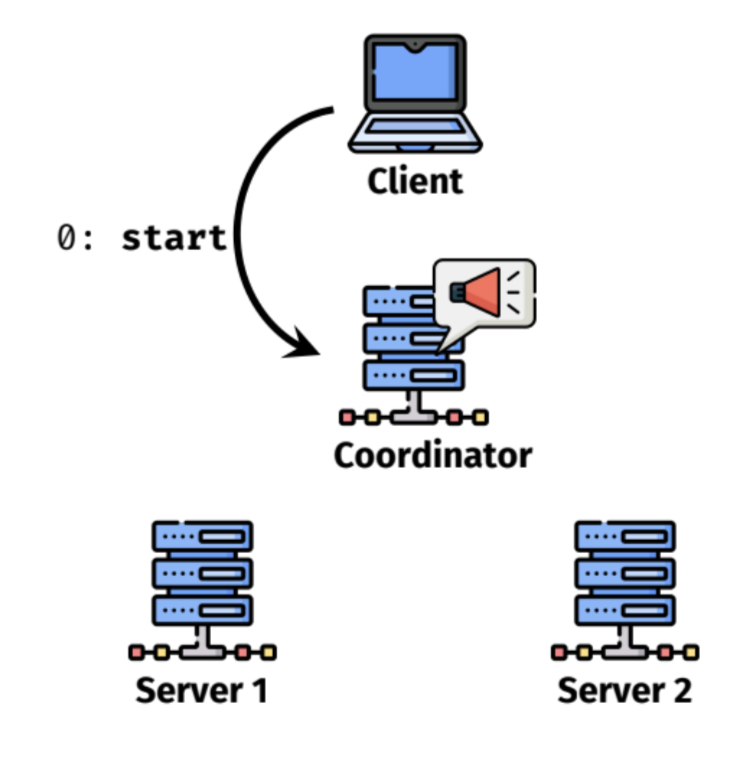
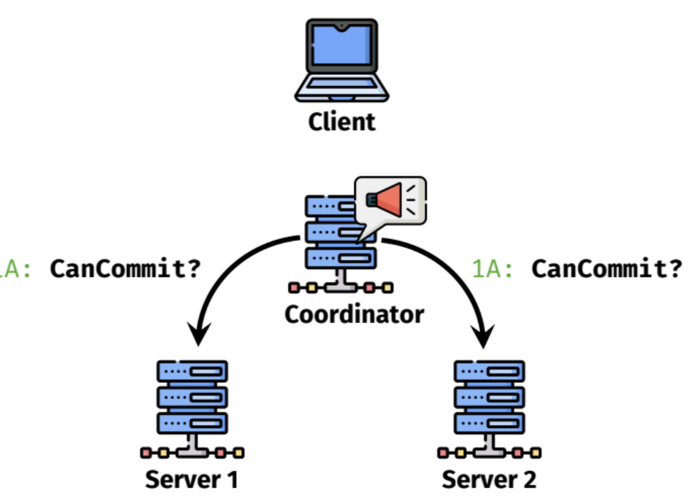
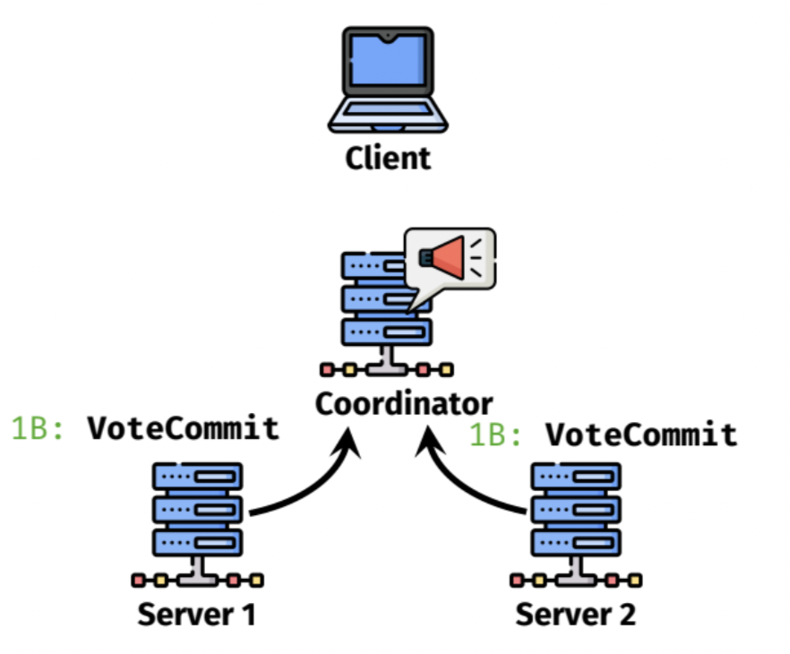
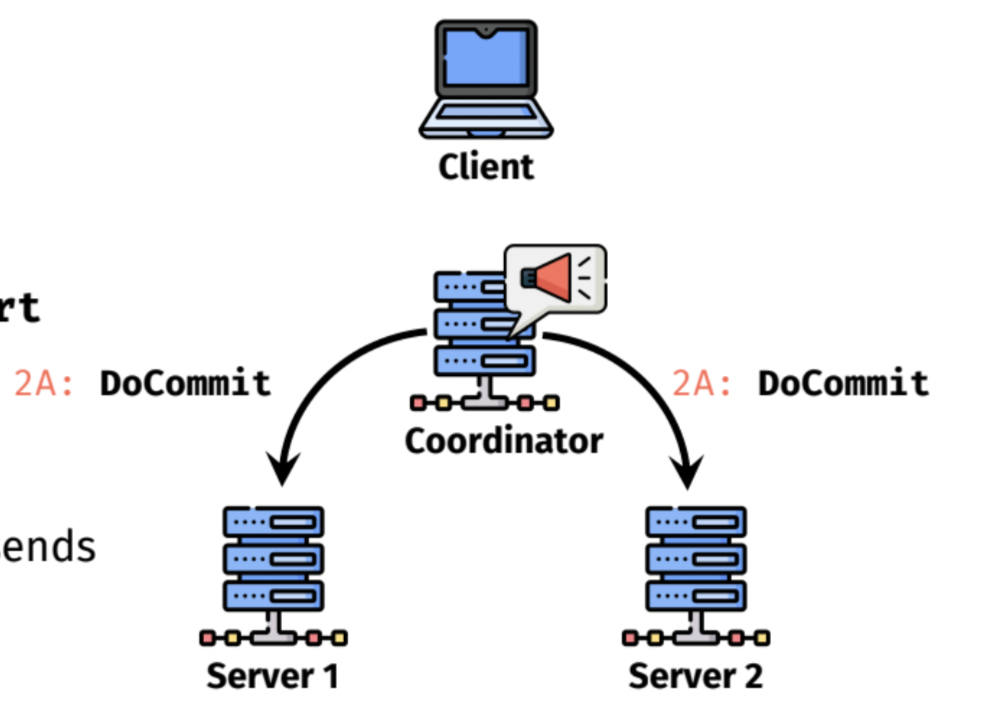
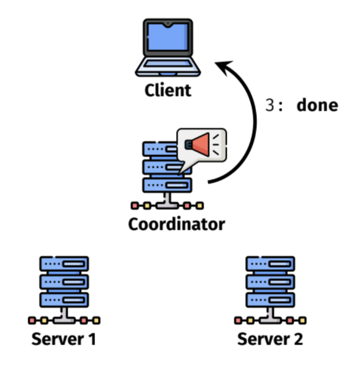
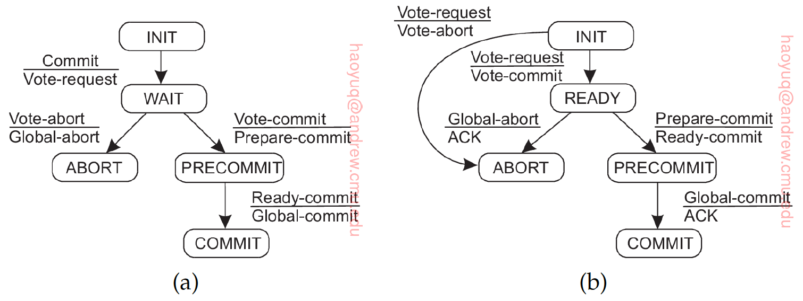

# Concurrency Control

## Transactions

### **ACID properties**

- Atomicity： 操作是整体的，要么全做完要么全abort
- Consistency：每一个transaction都获取global state
- Isolation：serializability 每一个transaction都像它独占global state的access一样
- Durability：做了的操作永远有效

### Single server situation

transaction开始前，获得锁；transaction操作结束，解锁。

这里的锁不能是global的，最好是一个item一个，否则global lock成为bottle neck

锁的获取是根据全局顺序的，这样不会出现死锁的情况。**Wait-for graph**可以帮助分析死锁，如果出现环，就是死锁的情况

### 2PL(2 phase locking)

Basic lock types：

- shared lock(read)
- exclusive lock(write)

Phases:

- Phase 1: growing
- Phase 2: shrinking

**2-phase locking**：

- Phase1: acquire or escalate locks
- Phase2：immediately enter this phase after it release the first lock（逐渐release lock，其他事务可以开始获取lock了，该事务的dependant事务可能还在获取，会因为该事务释放了部分lock而**造成cascading aborts**）

**Strong-strict-2-phase locking**：

- Phase1: acquire or escalate locks
- Phase2：Release **ALL locks** **at end of transaction** only.（要释放就一起释放，不会造成cascading aborts）

Example:

Phase 1: Preparation:

- Determine what has to be done, how it will change state, without actually altering it.

- Generate Lock set “L”
-  Generate List of Updates “U”

Phase 2: Commit or Abort:

- Everything OK, then update global state

-  Transaction cannot be completed, leave global state as is

-  In either case, RELEASE ALL LOCKS

  

**Deadlocks** **handling**

- 上面的说法并没有完全解决deadlock，因为有的时候transaction不能提前知道它要获取什么item的锁（获取了1的锁，调用函数，发现需要获取0的锁的情况）
- 解决办法：
  - lock manager build wait-for graph，监测到环，找出问题事务，abort
  - timeout abort

### Distributed Transaction

涉及到多个machine，所有machine commit或abort

流程：

- Client initiates transaction.
- Makes use of a **coordinator**
- All other relevant servers operate as **participants**
- Coordinator assigns **unique transaction ID (TxID)**
- Distributed commit: **2-phase commit**

**1-phase commit**：

coordinator告诉participants要做什么，显著缺点就是如果participant挂了，coordinator并不知道

**2-phase commit**：

coordinator告诉participants要做什么，询问能否做，participants试做，如果没有问题，回答；coordinator收到回答，发出commit或者abort的指令，participants改变本地状态，显著缺点就是无法处理coordinator挂了的情况

- Phase1 **prepare&vote**
  - coordinator asks participants cancommit？ participants figure out state changes，determine if it can complete transaction, reply with OK/Abort.
- Phase2 **commit/abort**
  - coordinator collects vote and if all can commit, **broadcast COMMIT**, participants do the state change
  - once receive **any** abort message or **timeout**, coordinator **broadcast Abort**

**Failure Handling**

participants和coordinator在block等待新的消息的时候都具有state（引入了timeout，有限时间等待）

participant vote commit之后block等待coordinator指令，一直没等到的情况：

1. block直到coordinator recover
2. 询问其他participant，观察其他participant的状态（COMMIT/ABORT）

participant在vote之后crash的情况，询问其他participant的状态

**Deadlock handling**

- cyclic dependency of locks on different server, participants cannot do local operation, blocking reply to coordinator
- handled with timeout, redo transaction, might incur livelock(keep trying)

**3-phase commit**

(PS: 其实2PC比3PC更常用，因为让2PC block的情况很少)

3PC比2PC多了一个Precommit状态，如果coordinator block在wait状态等待全部vote-commit，全部收齐后发送prepare-commit转入PRECOMMIT状态。participant收到prepare-commit进入PRECOMMIT状态并返回ready-commit，coodinator收到ready commit发送global commit。

- 如果coordinator在precommit状态时participants crash了，coordinator一直收不到ready commit，但是participants知道自己已经投票commit，所以recovery之后最终会达成commit的状态
- 如果participants在precommit状态，coordinator crash了，praticipants询问其他participants的状态，如果commit/abort，转入该状态；如果都是precommit，则达成commit状态
- 如果participants在ready状态，coordinator crash了，praticipants询问其他participants的状态，如果commit/abort，转入该状态；如果init（participantA precommit和participantB init不可能同时出现，init代表还没投票），abort；如果ready（一个ready状态的participant可能crash再recover，recover之后很可能不会恢复ready这种中间状态而是变成init状态，相当于没投过票就应该abort），abort
