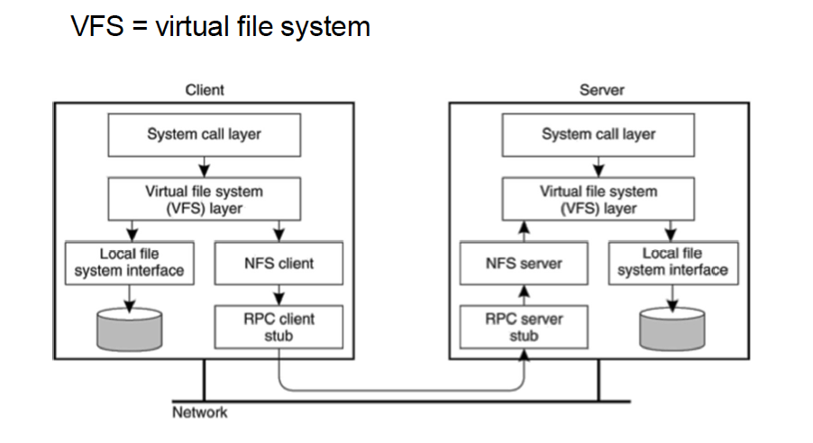
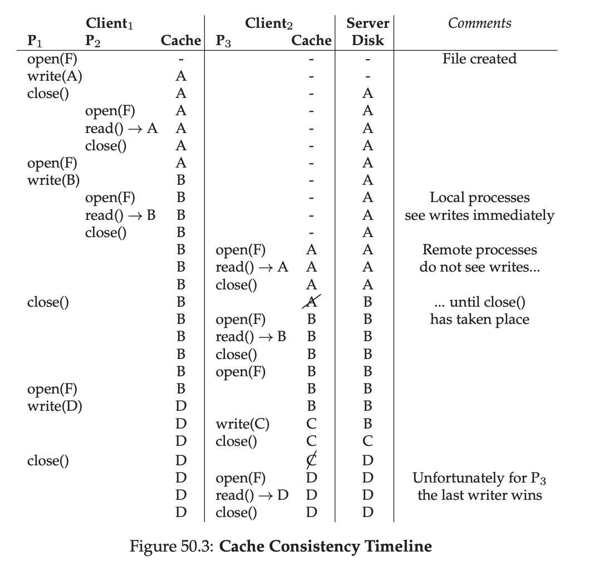

# Distributed File System

## 概述

- Why？好处？

  - 提供和普通file system一样的API

  - easy sharing

  - location transparency

  - 集中管理（备份文件在server端下载，而非client维护）

- 困难

  - 异构，不同的操作系统，不同机器...
  - 规模
  - 安全
  - 并发
  - 宕机和重启

- 位置

  

## How？

使用RPC引入了网络时延，为了解决网络时延引入了cache，但是需要处理多个client cache consistency的问题。

### Broadcast Invalidations

- 每次update之后通知所有client
- 简单，强consistency但**不现实，太多通讯**

### Check on use

- NFSv2使用，每次读之前问server有无更新
- 强consistency，**太多通讯，slow reads**
- NFSv2为了解决问题引入了attribute cache，但牺牲了consistency

### Callbacks

- AFS使用，client在server那儿注册自己有什么local copy，如果更新server告诉相应client cache invalidate
- server crash之后询问client有什么copy恢复state
- client crash之后标记所有local copy suspect
- server有状态，crash recovery耗时

### Lease

- GFS使用，client请求读数据时，server传回数据和lease，lease保证了在lease时间内server不会更新该数据，除非得到lease holder(拿着lease的client)的同意

- client请求写数据时，server会defer该请求直到所有lease holder同意或者租约过期

- 租约过期后，client再次请求读数据时，会先请求续租，得到新的租约和数据(也许已经更新了)

  

## Security

AFS使用KDC(Key Distribution Center)来验证对称密钥

- 对称密钥
  - 双方持有同样的密钥，经密钥A发送的信息只能通过密钥A解密，速度快 eg：AES
  - 对称密钥需要先在KDC注册，KDC掌握所有用户的密钥（所以只适合公司内网，不适合Internet）
- 非对称密钥：双方分别持有公钥和私钥，速度慢 eg：RSA

# 应用

## Sun NFS

- Sun 并没有用封闭的系统而是定义了一个**Open protocol**描述了client和server通信的格式，不同组可以根据协议开发他们自己的NFS，加入这个NFS open market

### Server Recovery in NFS2

- 快速recovery的核心是**stateless**， 每一个request都包含client或server需知道的全部的信息
- 这样设计之后，server crash了就重启，client 端重传信息即可；client crash与server无关
- stateless nature限制了更多的优化

### NFS2 stateless protocol

- file handle
  - volume identifier 标记使用哪个file system
  - inode number 标记file
  - generation number 当inode number被重用在其他file，generation number+1，保证client with outdated generation number不能访问新文件
- MOUNT
  - client使用NFS MOUNT protocol获得file system 根目录的handle
- LOOKUP
  - client使用LOOKUP获得file handle用于后续访问文件
  - client传入directory handle和file name，server返回file handle和attributes
- READ
  - client传入file handle，offset，read byte
- WRITE
  - client传入file handle，offset，write data
- close
  - client端掉用close关闭文件并不需要发送信息到server（因为stateless）

### Idempotency

- Idempotency指只要输入不变，多次调用获得的结果是相同的
- 对于idempotent的操作，如果client没有收到response，重试就行
- 一般来说，读操作是idempotent的，写操作根据设计可能不是idempotent。 NFSv2中的LOOKUP，READ，WRITE都是idempotent的，MKDIR不是idempotent(MKDIR成功但是ack lost后client再次尝试MKDIR会收到dir already exist的返回)

### Client Side Caching

- Client cache有两个作用：后续读直接从本地读，提高效率；client更新数据时充当client和server间的临时write buffer
- Client Cache Consistency：
  - client side caching面临两个问题：**Update Visibility** client更新了本地数据后，如果cache buffer了太久，server端和其他的client看到的还是老版本；**Stale Cache** client本地数据落后于server端
  - 解决**Update Visibility**：**Flush on close**(close to open) 如果client更新了本地文件，该文件被client关闭后传给server
    - flush on close在client开很多临时文件又迅速删掉它们的情景下会导致性能下降，因为这些文件依然会被传给server，实际上是不必要的。好的处理是临时文件放内存里，不涉及与server交互。
    - 这导致close会hang直到所有修改的block传给server，不是一个常见的操作，很多client application不会处理close error
  - 解决**Stale Cache**：client端保存file data，每次读cache前发送**GETATTR**到server，拿到最新的file attributes和本地修改时间比较
    - 这样导致每次读都要发送GETATTR，但通常情况下没有更新。为了解决这个问题，NFSv2引入**attribute cache**，client在attribute cache timeout前读attribute cache来比较修改时间，attribute cache每隔一段时间(eg: 3s)timeout
    - attribute cache的引入也导致了weak consistency，有时用户访问的是最新的，有时用户访问的是老的

### Server Side Write Buffer

- Server side的cache支持访问命中直接读内存，但是收到WRITE request之后，只会在数据写入稳定存储(disk)之后才返回success（否则如果server在写buffer后crash，client收到success认为写入成功不会retry）
- 这导致了Write成为NFS的性能瓶颈，有些公司采用将Write写入battery-backed memory之后发success来提升性能；有些公司采用专门的write fast filesystem来提升性能

### VFS

- Sun还设计了VFS使得不同file system可以轻松接入操作系统

### 总结

- NFS是80年代的设计，限于server的性能，只能设计stateless的server，但是这样阻碍了进一步的优化和应用
- NFS attribute cache的引入导致它经常出现不符合预期的cache，只适用于面向用户的fs，对于更高要求的dfs就不行了
- Write是NFS的性能瓶颈，因为server端只有写入稳定存储后才返回success

## AFS(Andrew File System)

- 不同于NFS着重在简单的protocol，快速重启server，AFS关注点只有一个：**Scale**
- AFS最大的特点是使用whole file caching

### AFSv1

- client调用open之后，client端存储整个文件到磁盘（为什么要存到磁盘？因为整个文件可能很大）
- 后续read，write都只用读本地
- client调用close之后，如果文件修改过，文件刷回server端
- 下一次client再访问时，client发TestAuth消息问server文件是否更新过，如果没有，则使用本地存储
- client端只存文件，目录还是存在server端

### AFSv1的问题

- path traversal太花时间了，client传full path，server必须做full path traversal
- 就像NFS的GETATTR，AFS client传了太多TestAuth，server必须处理TestAuth并告诉client它是否可以使用它的本地存储，很多时候答案都是ok

上述两个问题导致AFSv1的瓶颈在server端CPU，AFSv1每个server可以支持约**20**个clients。AFSv2引入了callback和file identifier来解决上述问题

### File Identifier

- file identifier类似NFS的file handle，包含**volume identifier**，**file identifier**和**uniquifier**
- 类似NFS的设计，server不再需要做path traversal，而是client做，每次请求一个目录或文件，存本地，建立callback

### Callback

- callback是server对client承诺如果client缓存的文件被修改，server会发送信息给它，类似interrupt（getattr和testauth的设计类似polling）

- 如果clientA更新并关闭了文件，新版本文件flush到server之后，server会立刻通知其他client它们的local copy invalid，其他client再次调用open打开文件时检查callback标志位并refetch该文件

- AFSv2也更改了多个进程打开同个文件时的规则，在AFSv2中，processA和B都打开了文件，processA写入文件，processB能立刻感知（一般情况是processA写入并关闭文件，processB才能感知文件更新了）

- 如果同时有多个client打开同个文件并修改，last writer wins，谁后关用谁的

  

### Crash Recovery

由于callback机制，server和client都不是无状态的。AFSv2的crash recovery比NFS更复杂

- client crash：重启后应将所有local copy作为suspect，open时需要发送TestAuth检查是否为最新状态
- server crash：server重启后需要重新知道client的local copy情况，还需要通知client它crash了要求client suspect它的local copy，这有多种实现方式
  - server/client定期发heartbeat表示自己alive
  - server reboot之后通知所有client不要相信此刻的local copy

### 总结

- AFS是90年代的设计，和NFS一样是central server，所有的read和write都至少访问server一次，server是瓶颈
- AFS相比NFS有更小的server load，server使用callback而不需要响应轮询
- AFS可能更慢，在LAN中，通过网络访问其他机器的mem比访问自己的disk快

## AFS vs NFS

- $L_{x}$表示通过x访问一个block的数据，默认$L_{net}>L_{disk}>L_{mem}$
- $N_x$表示一个x size的文件中的block数量，$N_L$表示大于client local mem cache的文件

1. 第一次读NFS和AFS都要通过server传给client，AFS本来设计会将读到的文件写磁盘，但因为利用了client os的mem cache可以视作性能与NFS一致
2. 后续读NFS和AFS都读local copy，NFS涉及到GETATTR但是有attr cache，AFS涉及到读磁盘但是利用client os的mem cache
3. 后续读中等文件与small一致
4. 后续读中等文件与small一致
5. 第一次读大文件NFS和AFS都通过server传给client
6. 后续读大文件，NFS local mem存不下（前面block已经被后面block替换了，不在内存中）需要重新让server传；AFS因为用磁盘作为local copy存储位置，访问磁盘即可
7. 单次读大文件，NFS只用访问单个block，AFS需要存全部文件
8. 小文件顺序写（文件本身不存在，写新文件），NFS和AFS都需要close之后传给server
9. 大文件顺序写一样的
10. 大文件重写（文件本身存在，覆盖原位置）NFS只需要知道file id和offset，本地写好传给server即可；AFS需要先读文件，存本地磁盘，再写好传给server，是NFS2倍时间
11. 大文件单次写，NFS只需要本地写好一个block传给server，AFS需要先读文件再写文件传给server
