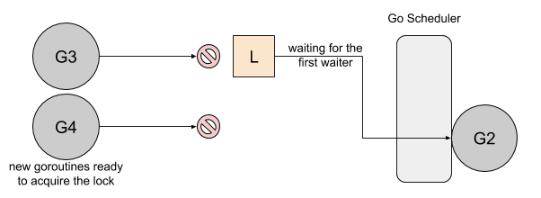
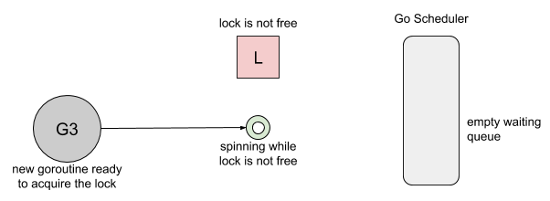
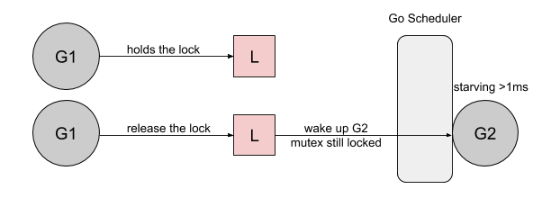

# Go开发笔记

- 同时多个goroutine 读写channel，不用包在lock里

- map需要make

  ```go
  var m map[int]int				// == nil
  m := make(map[int]int) 	// != nil
  ```

- 不能defer goroutine，最多

  ```go
  defer func(){
  	go goroutine1()
  }
  ```

- select的分支不会同时进行，靠channel select可以省掉mutex，相当于所有操作都在synchronization情况下进行

  ```go
  for{
  	select{
  		case amount:=<-withdrawchannel:
  			totalamount -= amount
  		case amount :=<-depositchannel:
  			totalamount += amount
  	}
  }
  ```

- 一个关闭信号关多个goroutine

  ```go
  for{
  	select{
  		case _,ok := <-done:
  			if !ok{
  				// 代表done channel被close了
  				return
  			}
      default:
      ...
  	}
  }
  
  // 关闭done channel，发送关闭信号
  func (s *Server) Close(){
    close(s.done)
  }
  ```

- 接收到关闭信号之后不立刻关闭（等待发送所有pending的数据/等待多个关闭信号）

  ```go
  for{
  	select{
  		case _, ok := <-done:
  			if !ok{
  				done = nil				// 标记done为nil,则该分支不会再被触发；否则done关闭之后该分支每次都可能被触发
  			}
      case _, ok := <-done2:
      	if !ok{
      		done2 = nil
      	}
      default:
      	if done1==nil && done2==nil{
      		return						// 检查是否满足所有条件
      	}
  	}
  }
  ```


## Go中锁的设计

- 参考文档：
  - https://medium.com/a-journey-with-go/go-mutex-and-starvation-3f4f4e75ad50
  - https://webkit.org/blog/6161/locking-in-webkit/


```go

func main() {
	done := make(chan bool, 1)
	var mu sync.Mutex

	// goroutine 1
	go func() {
		for {
			select {
			case <-done:
				return
			default:
				mu.Lock()
				time.Sleep(100 * time.Microsecond)
				mu.Unlock()
			}
		}
	}()

	// goroutine 2
	for i := 0; i < 10; i++ {
		time.Sleep(100 * time.Microsecond)
		mu.Lock()
		mu.Unlock()
	}
	done <- true
}
```

- 上述代码中goroutine1长期持有锁，短暂释放；goroutine2短期持有锁。简单的设计会造成goroutine2 starvation，持有锁的时间远远小于goroutine1。Go1.9之前的设计是结合`barging`和`spinning`

  - `barging`: 锁未被占用且有新请求时，唤醒第一个waiter，再决定是把锁给incoming new request还是awoken goroutine

  - `mutex handoff`: 释放锁时hold锁直到queue中的第一个waiter wake up并准备好获取锁

    - 这个做法导致程序需要花费等待waiter wake up的时间，即使它没醒之前就已经有goroutine准备好用锁了
    - 常见的锁设计都支持`lock stealing`, 即无需等待waiter，这导致正在运行的进程往往优先于等待的，造成starvation，但是比handoff吞吐量高

     

  - `spinning`: 当1. queue中没有进程等待用锁，2. 当前锁被其他进程占用时，3. 拥有多个处理器(单一处理器spin就block当前进程了) 新请求的进程可以spin一段时间而不park进queue里(进程的park和唤醒也需要花费时间)

    

- Go 1.9之后用新starvation mode，即bounded waiting

  - `bounded waiting`: 等待用锁超过1ms的goroutine标记为starving，当queue中第一个waiter是starving的，release锁之后直接把锁交给第一个waiter（新goroutine不用spin等锁，因为等了也没用，如果第一个waiter starving，新goroutine肯定没法拿锁）

  

