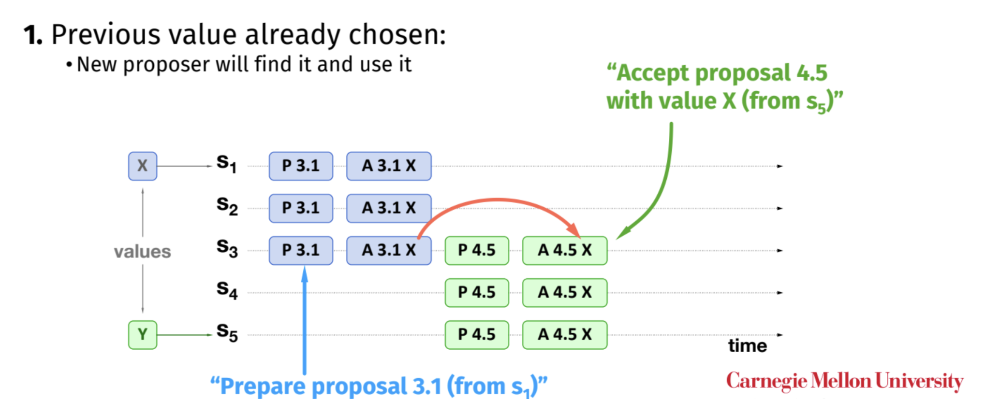
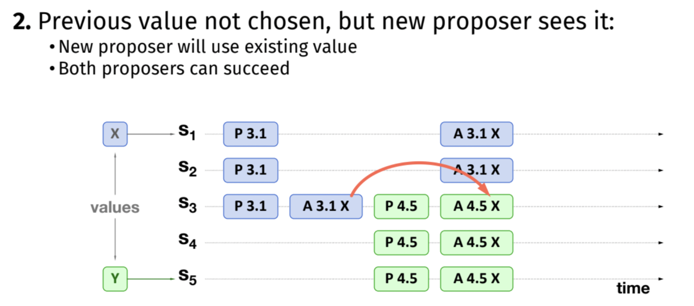
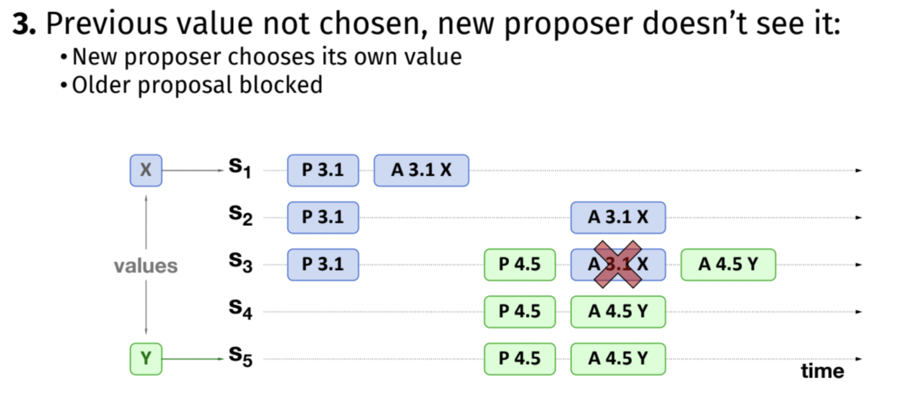
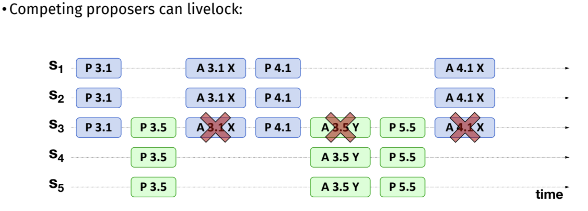

# Paxos

Paxos是一个从所有proposed values中选一个让所有client同意的算法。A **run** of Paxos只会选出一个proposed value。

如果需要实现replicated log (replicated state machine，像raft那样的)，需要**多次run**，也叫**multi-paxos**。

Paxos中的node有三个角色：**proposer，acceptor，learner**

1. proposer收到client传来的value，proposer生成一个**proposal number**。proposal number是unique的，并且需要大于该集群之前所有用过的proposer number。（可以用increasing identifier.node id, 比如node3可以用1.3，下一次可以用2.3。如果某一次它提出的proposed value被拒绝了，proposer就知道可能是increasing identifier小了，然后继续+1重试）

   

2. proposer发送**Prepare(proposal number)**给至少超过半数的acceptor，acceptor比较proposal number 和max_id，如果当前的小，不回答或回答fail。否则判断自己之前是否accept了proposal，如果有，返回Promise附带**accepted value**和**accepted proposal number**，如果没有，返回Promise

   ```python
   if (ID <= max_id)
           do not respond (or respond with a "fail" message)
       else
           max_id = ID     // save highest ID we've seen so far
           if (proposal_accepted == true) // was a proposal already accepted?
               respond: PROMISE(ID, accepted_ID, accepted_VALUE)
           else
               respond: PROMISE(ID)
   ```

   

3. proposer收到**超过半数的Promise**，判断这些promise中是否有accepted id，如果没有，则proposer可以提任意他想提的proposed value；如果有，只能提promise中**proposal number最大的accepted value**作为proposed value

   ```
   do I have PROMISE responses from a majority of acceptors?
   if yes
       do any responses contain accepted values (from other proposals)?
       if yes
           pick the value with the highest accepted ID
           send PROPOSE(ID, accepted_VALUE) to at least a majority of acceptors
       if no
           we can use our proposed value
           send PROPOSE(ID, VALUE) to at least a majority of acceptors
   ```

   

4. 发送**Propose(proposal number，value)**给acceptors询问是否同意此次proposal

​		acceptor判断是否这个proposal number是当前收到过最大的，如果是，发送**Accepted(proposal number, Value)**给learner/proposer，否则不回答或回答fail

```
is the ID the largest I have seen so far, max_id == N?
	if yes
    reply with an ACCEPTED message & send ACCEPTED(ID, VALUE) to all learners
	if no
    do not respond (or respond with a "fail" message)
```

3. proposer/learner收到**超过半数的accepted**,标记该value被同意了


## 示例



- S1发prepare(3.1)

- S1, S2, S3 记max_id = 3.1, 回复promise

- S1发propose(3.1, X)

- S1, S2, S3回accept(3.1, X)

- S1标chosen proposed value为X

- S5发prepare(4.5, Y)

- S3记max_id = 4.5, 回复promise(3.1,X); S4,S5记max_id=4.5，回复promise

- S5检查promise回复，其中最大的accepted id为3.1，记proposed value为X，发propose(4.5, X)

- S3, S4, S5回accept(4.5, X)

- S5标chosen proposed value为X

  

  

和上述例子没什么区别，虽然S3没收到回复不知道x被chosen的时候S5就propose了，但是S3已经记下accepted value为X了



- S1发prepare(3.1)

- S1, S2, S3 记max_id = 3.1, 回复promise

- S1发propose(3.1, X)

- S1收到回accept(3.1,X)(S2,S3未收到)

- S5发prepare(4.5, Y)

- S3,S4,S5记max_id = 4.5, 回复promise

- S5检查promise回复，无propose id发propose(4.5, Y)

- S2, S3收到propose(3.1, X), S2回accept(3.1,X),S3发现3.1小于max_id 4.5，不回复/回fail

- S3,S4,S5收到propose(4.5, Y),回accept(4.5,Y)

- S5标chosen proposed value为Y

  

  

上面的算法可能导致livelock，一个propose过了第一阶段(prepare and update max_id)，还没到第二阶段（accept accepted value）时新的propose第一阶段到了更新max_id，max_id更新后acceptor拒绝了旧的propose请求。旧请求increase poposal number重发prepare过第一阶段，acceptor继续更新max_id...

解决办法：

- randomized delay before restarting（像raftrandom delay to start election request）
- multi-paxos选leader