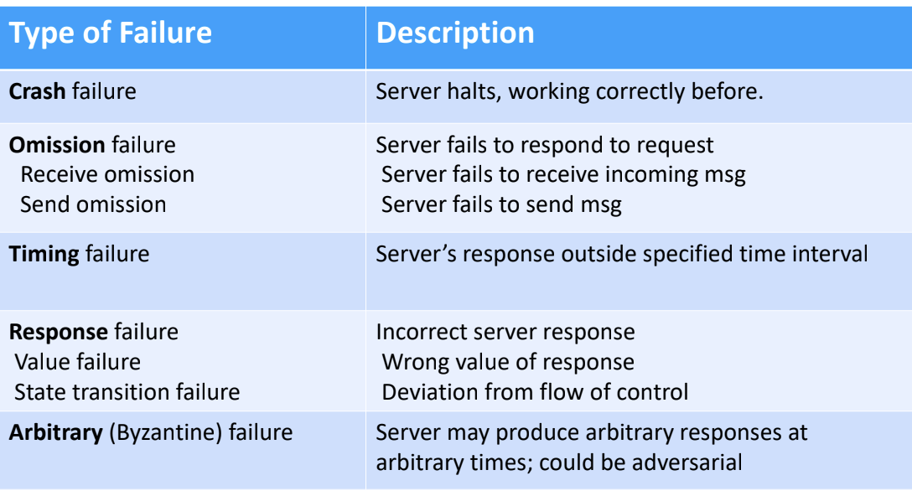
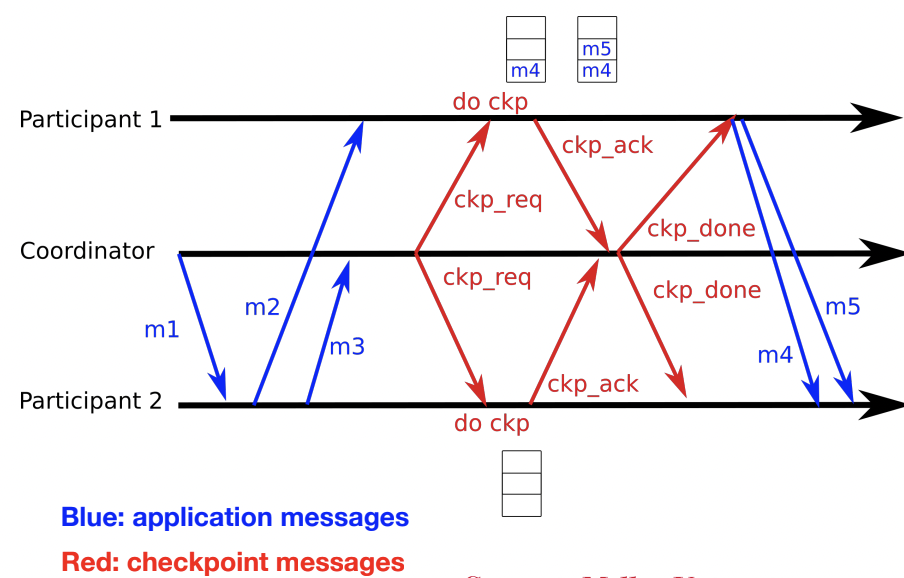
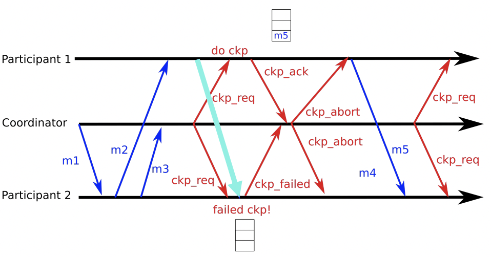

# Fault

How to deal with failure?

- Information Redundancy(extra bit to check, hamming codes)
- Time Redundancy(Retransmission)
- Physical Redundancy(add duplicate hardware/software)

# Recovery

**backward recovery**: 恢复到发生错误之前成功的状态，需要定时保存状态（eg: **checkpoint**）

**forward recovery**: 转移到下一个server可以正常执行的状态，需要知道错误究竟是什么

## Checkpoint

**Pros**: less roll back

**Cons**: Overhead during normal operations(需要定期IO save checkpoint)

**Independent checkpoint**: each node takes its own checkpoint

- liable to **cascaded rollback**

**Coordinated checkpoint**: all nodes are synchronized when a checkpoint is taken

- 2-phase blocking protocol(like 2pc)

  

- might faile if participant1 send messages to participant2 during doing checkpoint

  

## Logging and Recovery

store enough data on disk to recover to a valid state after a crash

### database buffer pool management policies

**steal**: 是否允许未commit的事务写磁盘

**force**: 是否强制事务commit前的更新写在磁盘上

### Shadow Paging

​	**NO STEAL** + **FORCE**

​	maintain 2 seperate copies of the DB on disk, when writing a page, make a shadow copy, like "copy on write" to avoid in-place page update

​	ABORT: discard shadow page

​	COMMIT: make shadow page real

​	Problems: Copying entire page table is expensive, random I/O to disk in the critical path

### Write-Ahead Logging

​	**STEAL + NO FORCE**（**Widely used**）

​	先写Log再写实际update，实际update被写入稳定存储前，log必须先写入稳定存储

## ARIES

Algorithms for Recovery and Isolation Exploiting Semantics

**STEAL + NO FORCE**（未commit事务可写磁盘，不强制事务更新写磁盘）

ARIES有以下三个性质：

- Write-Ahead logging
- Repeating history during redo：crash重启后，先redo没刷到稳定存储中的更新把系统恢复到crash前状态
- Logging changes during undo：undo transactions still active at crash time

还是没懂：

DPT要不要存已经刷到disk的update的lsn？

Redo要不要做已经刷到disk的update？

