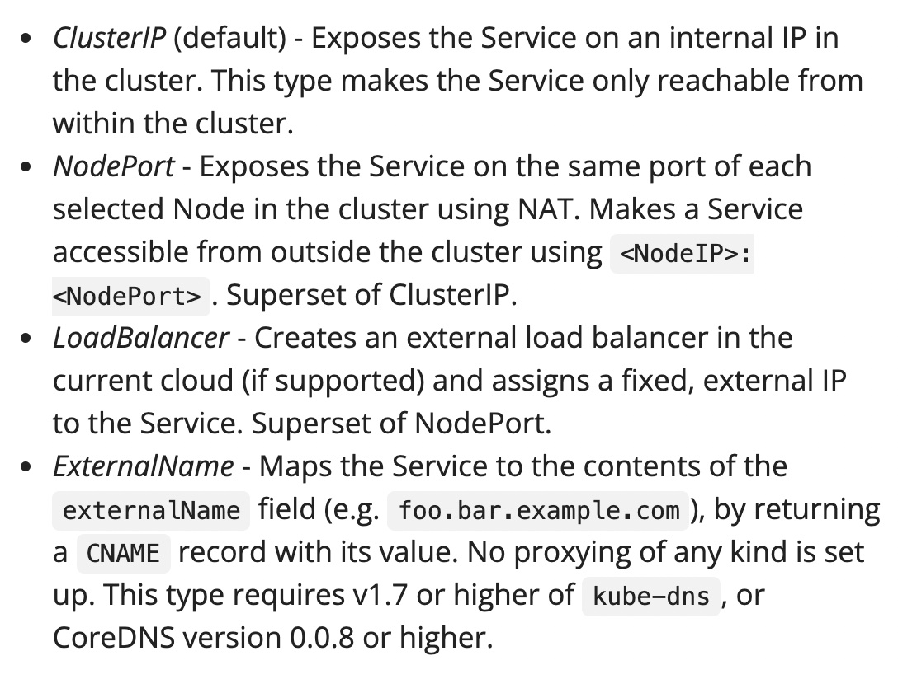

# k8s基本操作

1. minikube：`minikube start` 
   - minikube start会在本地创建一个只含有一个node的cluster
2. k8s deployment
   - deployment代替了手动启动和恢复的脚本，负责部署application
   - `kubectl create deployment <deploymentName> --image=<imageName>`
   - `kubectl get deployments`查看deployment
3. k8s proxy
   - pods运行在自己的网络里，一个cluster的pods可以互相联系，但是无法和外界通讯
   - k8s proxy可以创建一个代理，转发外界的通讯
   - `kubectl proxy`创建代理，输出代理的ip，eg：127.0.0.1:8001
   - host(minikube创建本地cluster的情况下，host是命令行终端)可以直接通过`curl http://127.0.0.1:8001/version`查看版本，还可以通过一些api查询pod相关信息等
4. Pods
   - 一个pod运行在一个node上，包含多个紧耦合的containerized application和其他控制信息
   - pod是deployment操作的最小单位，一个pod里面所有containers是一起调度一起部署的
   - 一个pod中的containers共享一个ip，同一个volume

5. Nodes
   - 一个Node可以运行多个Pod
   - Control Plane控制Pods的调度，Node上面有一个kubelet负责Node和control plane的沟通
   - Node上面的container runtime(Docker)负责注册启动container，run application
6. 工具
   - `kubectl get [nodes/pods/...]`展示大体状态信息
   - `kubectl describe [nodes/pods/...]`展示细节信息，包括运行的containers的image，ip，ports等等
   - `kubectl logs <podName>`展示application输出信息
7. 在container中运行command
   - `kubectl exec $POD_NAME -- env` 这里其实应该提供containerName，但是示例中的pod只含一个container，所以只提供了podName，输出环境变量
   - `kubectl exec -ti $POD_NAME -- bash`创建一个container的交互式bash shell
8. service
   - 当你有三个一样的Pod互相做replica，Pod可能会lost但前端应该感知不到Pod replica的交换和重启，这时需要一个service来控制
   - service决定了pods的一个logical set，还有关于如何access他们的决策
   - service可以将一群不同内部ip的pod暴露给外界
   - 四种不同的配置ServiceSpec的方式（暴露pod ip的方式）：
     - 补充链接：https://kubernetes.io/docs/tutorials/services/source-ip/
     - 补充链接：https://kubernetes.io/docs/concepts/services-networking/connect-applications-service/
   - service通过labels and selectors来match Pods: https://kubernetes.io/docs/concepts/overview/working-with-objects/labels/
     - 现代产品架构很复杂，包括不同的release track不同的tier不同的environment，每一个pod都有多个label（类似字节内部有boe，i18n和线上环境，不同的团队label等等）
     - 操作经常涉及到混合环境，此时像css选择器那样有个label选择器来选一批pods操作很方便

9. 深入文档：
   - k8s in action livebook: https://livebook.manning.com/book/kubernetes-in-action-second-edition/chapter-1/v-6/1
   - k8s与云原生: https://jimmysong.io/kubernetes-handbook/cloud-native/cloud-native-definition.html
