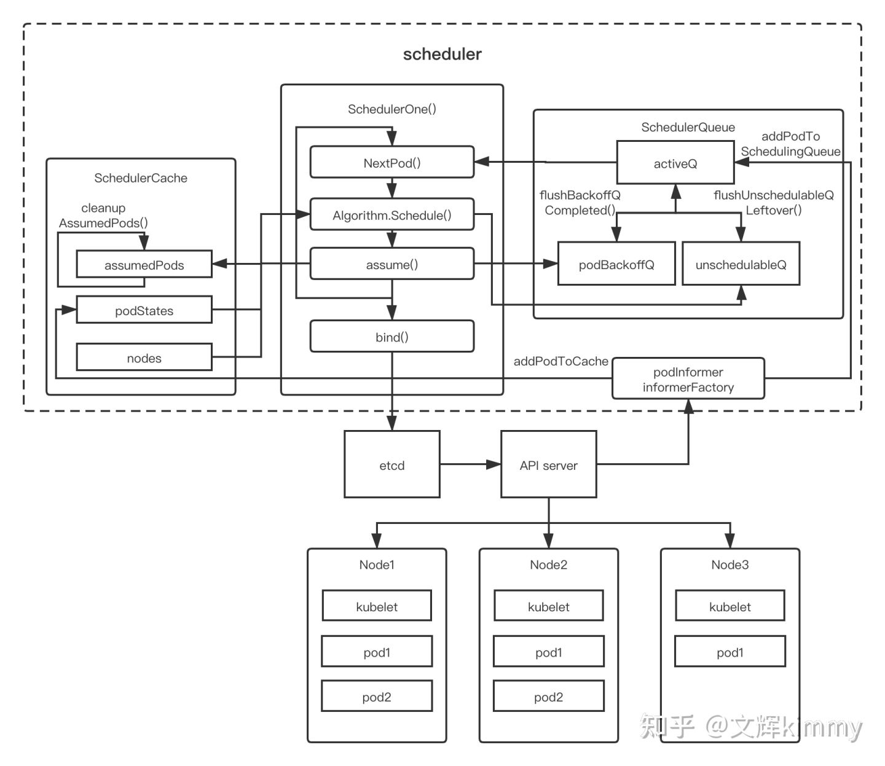
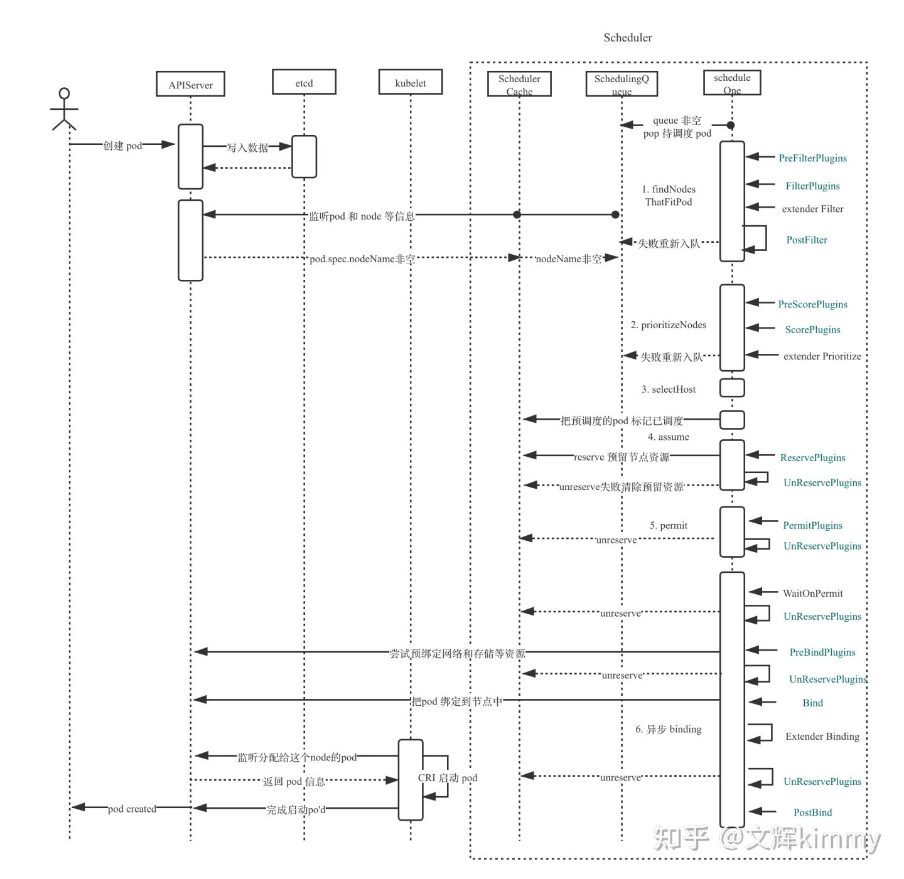

# Kube-Scheduler

- 是什么？

   k8s默认调度器，通过运行调度算法，将Pod放置到合适的Node上，然后Node伤的Kubelet才能运行这些Pod

- 主要组件

  ```go
  type Scheduler struct {
     // 主要是缓存现在集群调度的状态，如上图所示，会保留集群中所有已调度 pod 的状态，node 的状态，和assumedpod，防止 pod 被重新调度。
     SchedulerCache internalcache.Cache
     // Algorithm 需要实现 Schedule 的方法，输入一个 pod 可以找到合适 node。默认是通过   
     // pkg/scheduler/core/generic_scheduler.go 的 generic_scheduler 实现的。
     Algorithm core.ScheduleAlgorithm
       // 获取下一个 pod
     NextPod func() *framework.QueuedPodInfo
  
     // Error is called if there is an error. It is passed the pod in
     // question, and the error
     Error func(*framework.QueuedPodInfo, error)
  
     // Close this to shut down the scheduler.
     StopEverything <-chan struct{}
  
     // SchedulingQueue 会保留准备调度的 pod 的队列。
     SchedulingQueue internalqueue.SchedulingQueue
  
     // 所有的 plugin 都会以 profile 的形式供默认调度器使用
     Profiles profile.Map
  
     scheduledPodsHasSynced func() bool
       // 用于和 api-server 的通信
     client clientset.Interface
  }
  ```

- 流程图

  

- SchedulerCache保存当前集群的调度状态

- SchedulerQueue保存未调度的Pod

  - activeQ是通过heap实现的待调度优先队列
  - SchedulerQueue中两个Goroutine不停把BackoffQ（调度出错的Pod）和UnschedulableQ（不可被调度的Pod）中的pod刷到activeQ里

- Scheduler轮询执行ScheduleOne流程

  - 通过NextPod接口从activeQ中读取入队pod的信息
  - Algorithm(pkg/scheduler/core/generic_scheduler实现)为pod找到合适的node进行调度；这一步失败pod进入UnschedulableQ
  - 调度成功触发assume，在cache中记录该pod已调度
  - binding写etcd，api-server感知到之后通知node的kubelet去配置相应环境
  - schedulerCache有进程cleanupAssumedPods去看binding是否完成，binding完成则去除assume标志

  