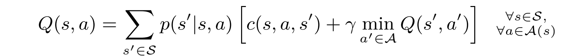
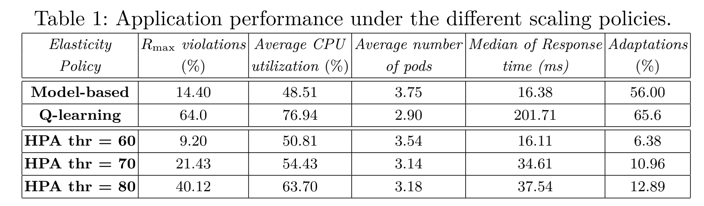

# 论文阅读

## 1. VMagent

- https://vmagent.readthedocs.io/en/latest/simulator/dataset.html
- [x] dataset：开源 代码：开源
- 目标：把request schedule到VM，有限资源内能handle越多request的调度算法越好

## Benchmarks/Baseline

- Without consolidation

- Firstfit

- Bestfit

## 建模

- state
  - cluster：**N** server **N1** numa(node) **n** number of resources ----> NxN1xn vector
  - request: n number of request resources(一般是cpu和mem2个)
  - state: [NxN1xn, n] 
- Action
  - In our VM scheduling, the scheduler is to select which server to handle the current request
  - Due to the double numa architecture, for the small requet (requested cpu is smaller than a threshold) it needs to be allocated on a specific numa of a server. This makes the action space to N. For simplicity, our SchedGym makes the action space 2N and the large request is handled by action%2.
  - 基本上是request调度到server层面，小request考虑分配到server的第一个numa上，大request均分给两个numa
- Reward
  - 同样的资源能够handle越多的request则代表该调度算法越优
  - once a request is handled, reward+1---->reward+request['cpu']（handle大request的reward更多）
- Transition Function
  - When a server handle a creation request (c0,m0), it will allocate (c0,m0) resource for the request. Specifically, if the server is [[c1,m1],[c2,m2]] and (c0,m0) is a large creation request. The server will be [[(c1−c0)/2,(m1−m0)/2],[(c2−c0)/2,(m2−m0)/2]]. If (c0,m0) is a small request and server’s first numa is to handle it, then the server will be [[c1−c0,m1−m0],[c2,m2]]. For the deletion request, the minus above will turn to add.

## 2. **Auto-scaling Policies to Adapt the Application** Deployment in Kubernetes

- [ ] dataset： 代码：

- 目标：RL-based QOS-aware scaling policies + 执行器(distributed control loop: monitor **cluster level cpu-utilization** and **application level response time**)

- ## Benchmarks/Baseline

  - k8s自己的scaling算法

- ## model-based RL建模

  - State：
    - s=(k,u) k是application的实例pod数量，u是monitored cpu utilization
    - u被分割成了离散值；K只能在[1,K_max]中取有限值
    - 总的state是所有application
  - Action：
    - 对每一个state，有+1，-1，0三种action，+1代表scale-out，-1代表scale-in
  - Reward：
    - immediate cost：We defifine the immediate cost *c*(*s, a, s'*) as the weighted sum of difffferent terms, such as the *performance penalty*, *c*perf, *resource*,*cost*, *c*res, and *adaptation cost*, *c*adp. We normalized them in the interval [0*,* 1],where 0 represents the best value (no cost), 1 the worst value (highest cost).Formally, we have: *c*(*s, a, s'*) = *w*perf *·* *c*perf + *w*res *·* *c*res + *w*adp *·* *c*adp, where *w*adp, *w*perf and *w*res, *w*adp + *w*perf + *w*res = 1, are non negative weights that allow us to express the relative importance of each cost term.
      - Performance penalty: 平均响应时间超过目标响应时间R_max
      - resource cost：propotion to pods的数量
      - adaptation cost：the cost introduced by k8s to perform a scaling operation
    - Q-function：
      - 

  - horizontal scaling vs vertical scaling
    - k8s做vertical scaling的方式是更改CPU limit，然后用新的Pod代替旧的Pod
    - 同时，k8s的traffic route会把request分到部署了特定application的pod上，不管它是不是已经在running
    - 所以，vertical scaling会导致application availability下降且只有少部分到达的request被响应
    - 作者更倾向于horizontal scaling(*horizontal scaling不就是要创建新pod然后deploy it，可以借鉴*)

- ## 结果

- 

## 3. ESFEC

- https://discos.sogang.ac.kr/file/2021/intl_jour/Towards%20Energy-Efficient%20Service%20Scheduling%20in%20Federated%20Edge%20Clouds.pdf
- 背景：边缘云计算，边缘服务器对delay和位置很敏感，traffic增大的时候需要迁移服务器同时保持服务器距离原path近，traffic减小的时候尽量把多个server co-located